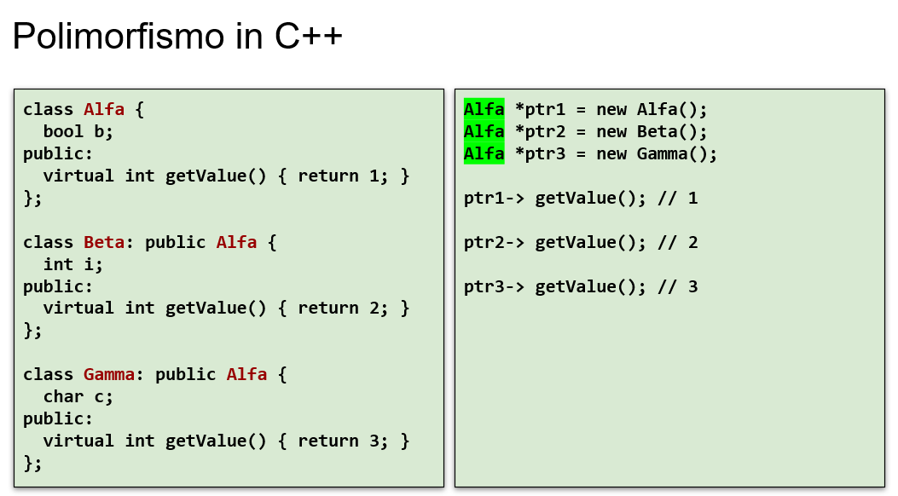
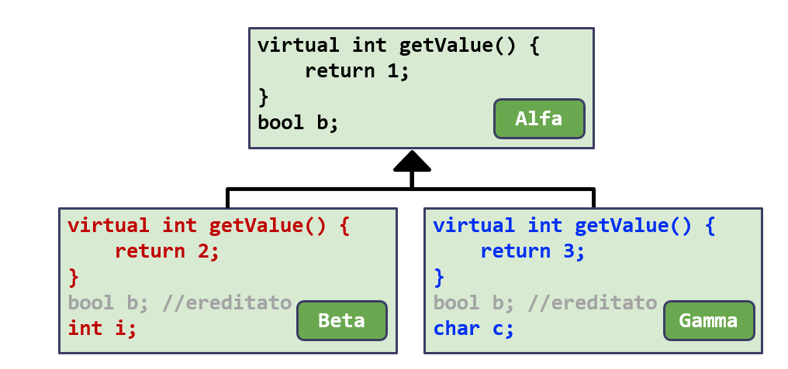
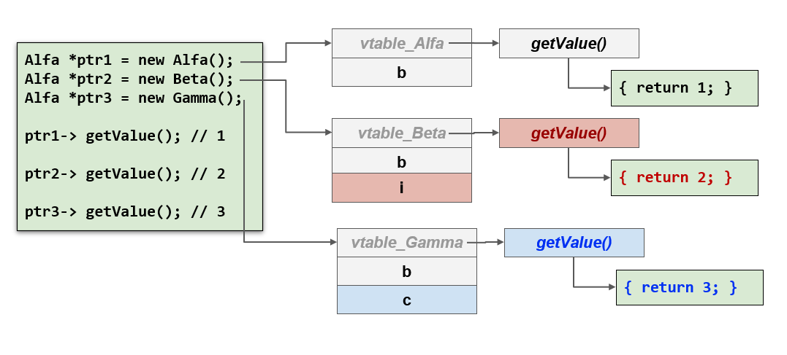
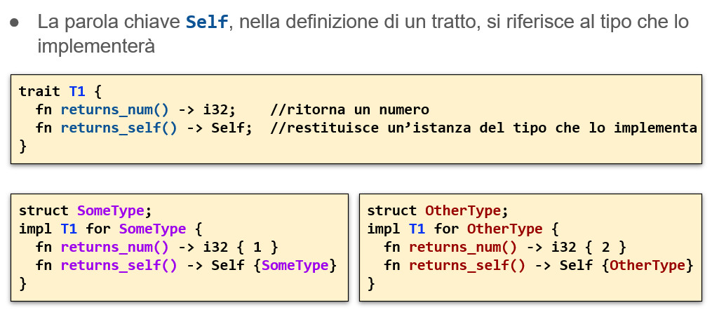
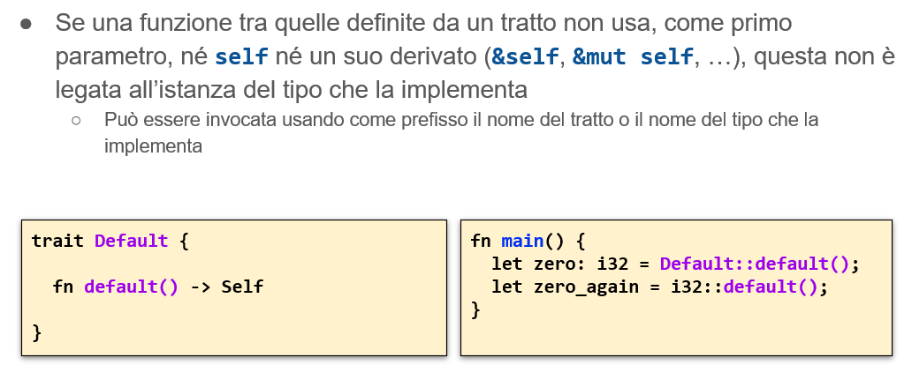
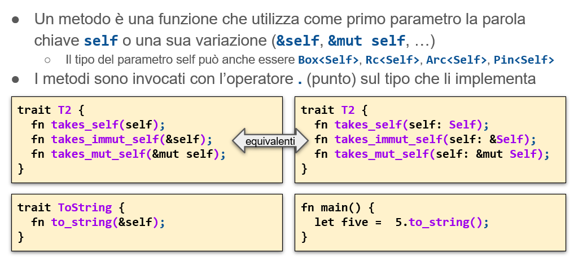
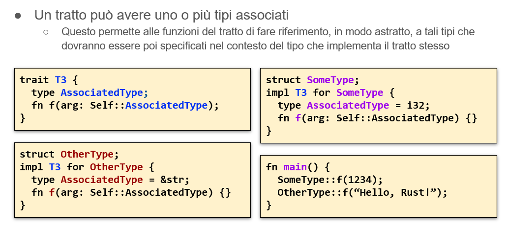
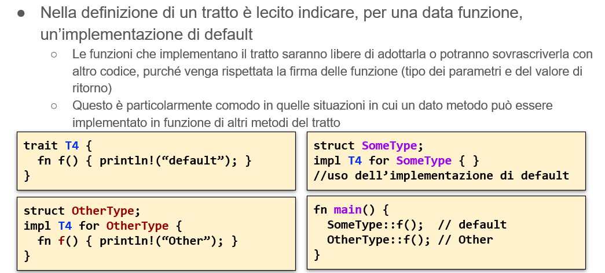
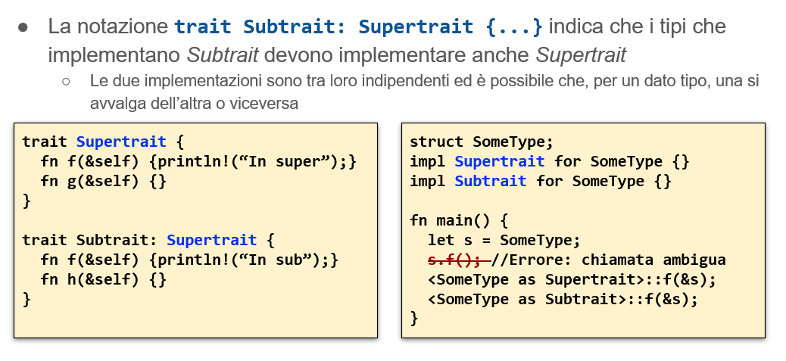
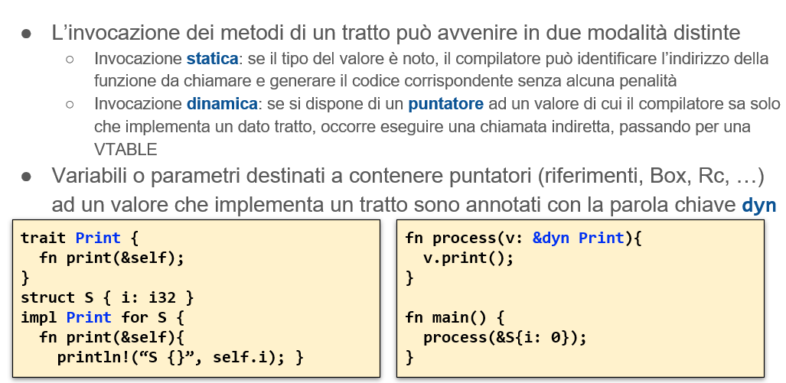

# Polimorfismo
- la necessità di minimizzare il codice scritto spinge verso l’identificazione di pattern comuni
- La soluzione individuata è il **polimorfismo**: capacità offerta dai linguaggi di associare comportamenti comuni ad un insieme di tipi differenti 
   - si può implementare con programmazione generica, interfacce o ereditarietà
## Polimorfismo nei vari linguaggi
- in c non c'è supporto sintattico specifico per implementare il polimorfismo
- il linguaggio ***C++*** supporta il concetto di ereditarietà e il concetto di metodo virtuale

## Polimorfismo in c++ 
- Un metodo così etichettato viene chiamato in modo indiretto, passando attraverso una struttura intermedia detta VTABLE
- Questa contiene un array con l’indirizzo effettivo dei metodi virtuali che la classe implementa
- Ogni istanza di una classe dotata di metodi virtuali dispone di un campo nascosto che contiene il puntatore alla VTABLE (costo in termini di memoria)
-Quando un metodo virtuale viene invocato, il compilatore genera le istruzioni necessarie ad accedere alla VTABLE e prelevare l’indirizzo da chiamare (costo in termini di tempo)s
### Polimorfismo in c++ esempio

```C++
int main() {
   // Alfa a;
   //std::cout<< a.m()<<std::endl;
   //std::cout<<sizeof(a)<<std::endl;

   //costruire oggetto sull'heap
   Alfa* ptr1 = new Alfa; 
   //un puntatore ad alfa può contenere un puntatore a beta
   Beta* ptr2= new Beta;
   std::cout<< ptr1->m()<<std::endl;
   std::cout<< ptr2->m()<<std::endl;
   std::cout<<"sizeof(*ptr1): "<<sizeof(*ptr1)<<std::endl;
   std::cout<<"sizeof(*ptr2): "<<sizeof(*ptr2)<<std::endl;

   delete ptr1; //passaggio necessario
   delete ptr2; //passaggio necessario

    return 0;

    //viene stampato:
    1
    2
    sizeof(*ptr1): 4
    sizeof(*ptr2): 16

}
// sottocaso 2
Alfa* ptr2 = new Beta;
 //in output 
1
1
sizeof(*ptr1): 4
sizeof(*ptr2): 4

// sottocaso 3: gli voglio dire che uso polimorfismo
int i;
    public:
    //m su alfa torna 1, su b torna 2// cambia sizeof
    virtual  int m(){
        return 1;
    }

//ora in ouput
1
1
sizeof(*ptr1): 16
sizeof(*ptr2): 16
//perchè da 16 è diventato 4 =>  quando in una classe compare almeno un metodo marcato virtual: gli oggetti instanza della classe acquisiscono un campo in più : vtable: tabella dei metodi virtuali: servono a risolvere gli indirizzi dei metodi
// c'è una vtable per classe
//compilatore vede virtual: il primo campo di ptr è puntatore alla vtable(): si prende l'indirizzo del metodo
//8 per tenere la vtable, 4 per l'intero e 4 di padding (per questo 16)

// cambio aggiungendo un metodo virtual
class Alfa {
    //bool  b;
    int i;
    public:
    //m su alfa torna 1, su b torna 2// cambia sizeof
    virtual  int m(){
        return 1;
    }
    virtual unsigned size() {return sizeof(*this)}
};
class  Beta : public Alfa{
    double d;
    public:
     int m() { return 2;}
    unsigned size() {return sizeof(*this);}
};
# Polimorfismo
- la necessità di minimizzare il codice scritto spinge verso l’identificazione di pattern comuni
- La soluzione individuata è il **polimorfismo**: capacità offerta dai linguaggi di associare comportamenti comuni ad un insieme di tipi differenti 
   - si può implementare con programmazione generica, interfacce o ereditarietà
## Polimorfismo nei vari linguaggi
- in c non c'è supporto sintattico specifico per implementare il polimorfismo
- il linguaggio ***C++*** supporta il concetto di ereditarietà e il concetto di metodo virtuale

## Polimorfismo in c++ 
- Un metodo così etichettato viene chiamato in modo indiretto, passando attraverso una struttura intermedia detta VTABLE
- Questa contiene un array con l’indirizzo effettivo dei metodi virtuali che la classe implementa
- Ogni istanza di una classe dotata di metodi virtuali dispone di un campo nascosto che contiene il puntatore alla VTABLE (costo in termini di memoria)
-Quando un metodo virtuale viene invocato, il compilatore genera le istruzioni necessarie ad accedere alla VTABLE e prelevare l’indirizzo da chiamare (costo in termini di tempo
### Polimorfismo in c++ esempio

```C++
int main() {
   // Alfa a;
   //std::cout<< a.m()<<std::endl;
   //std::cout<<sizeof(a)<<std::endl;

   //costruire oggetto sull'heap
   Alfa* ptr1 = new Alfa; 
   //un puntatore ad alfa può contenere un puntatore a beta
   Beta* ptr2= new Beta;
   std::cout<< ptr1->m()<<std::endl;
   std::cout<< ptr2->m()<<std::endl;
   std::cout<<"sizeof(*ptr1): "<<sizeof(*ptr1)<<std::endl;
   std::cout<<"sizeof(*ptr2): "<<sizeof(*ptr2)<<std::endl;

   delete ptr1; //passaggio necessario
   delete ptr2; //passaggio necessario

    return 0;

    //viene stampato:
    1
    2
    sizeof(*ptr1): 4
    sizeof(*ptr2): 16

}
// sottocaso 2
Alfa* ptr2 = new Beta;
 //in output 
1
1
sizeof(*ptr1): 4
sizeof(*ptr2): 4

// sottocaso 3: gli voglio dire che uso polimorfismo
int i;
    public:
    //m su alfa torna 1, su b torna 2// cambia sizeof
    virtual  int m(){
        return 1;
    }

//ora in ouput
1
1
sizeof(*ptr1): 16
sizeof(*ptr2): 16
//perchè da 16 è diventato 4 =>  quando in una classe compare almeno un metodo marcato virtual: gli oggetti instanza della classe acquisiscono un campo in più : vtable: tabella dei metodi virtuali: servono a risolvere gli indirizzi dei metodi
// c'è una vtable per classe
//compilatore vede virtual: il primo campo di ptr è puntatore alla vtable(): si prende l'indirizzo del metodo
//8 per tenere la vtable, 4 per l'intero e 4 di padding (per questo 16)

// cambio aggiungendo un metodo virtual
class Alfa {
    //bool  b;
    int i;
    public:
    //m su alfa torna 1, su b torna 2// cambia sizeof
    virtual  int m(){
        return 1;
    }
    virtual unsigned size() {return sizeof(*this)}
};
class  Beta : public Alfa{
    double d;
    public:
     int m() { return 2;}
    unsigned size() {return sizeof(*this);}
};

res:
1
1
16
24 //8 vtable 4 padding 8 double 4 int ereditato 

```

### Esempio slide





- 16 byte per alfa : 8 per la vtable  + booleano + eventuale padding
- 24 byte per beta : 8 vtable ( ha una sola entry : non c'è più il vecchio codice ora torna 2) , booleano b + intero

## Polimorfismo in c++

- Solo le funzioni membro denominate “virtual” sono polimorfiche
La presenza di metodi virtuali comporta una penalità in termini di spazio (ogni istanza contiene un puntatore alla VTABLE) e di tempo (ogni chiamata deve essere risolta passando tramite la VTABLE)
Una funzione membro non virtuale non ha costi aggiuntivi di chiamata
- E’ possibile omettere il corpo di una funzione virtuale, dichiarandola  “ = 0; ”
Questo rende la funzione virtuale astratta
- Se una classe contiene almeno una funzione virtuale astratta diventa una classe astratta
Classi di questo tipo non possono essere istanziate direttamente, ma possono essere usate come classi base da cui derivare sottoclassi concrete, purché dotate di un’implementazione per tutti i metodi astratti
- Una classe astratta pura contiene solo funzioni virtuali astratte
Equivalente a quella che in altri linguaggi di programmazione si chiamano interfacce (es. Java, C#)


# Tratti
- Non c'è l'ereditarietà in rust
- Equivalente in rust delle interfacce di java 
- Un tratto esprime la capacità di un tipo di eseguire una certa funzionalità : 
   - Un tipo che implementa 
    ```rust 
   std::io::Write 
   ``` 
   può scrivere dei byte. 

Un tipo che implementa std::iter::Iterator può produrre una sequenza di valori. Un tipo che implementa std::clone::Clone può creare copie del proprio valore. Un tipo che implementa std::fmt::Debug può essere stampato tramite println!() usando il formato {:?}. 
- A differenza di quanto accade in C++ o Java, se si invoca su un valore una funzione relativa ad un tratto, **non si ha - normalmente - un costo aggiuntivo.**  Né gli oggetti che implementano tratti hanno una penalità in termini di memoria per ospitare il puntatore alla VTABLE ( ad esempio enum non ha vtable). Tale costo si presenta solo quando si crea esplicitamente un riferimento dinamico (**&dyn TraitName**) {voglio tornare qualcosa su cui scrivere}

# Definire e usare un tratto
- Si definisce un tratto con la sintassi
```rust
 trait SomeTrait { fn someOperation(&mut self) -> SomeResult; … }
```
- Una struttura dati concreta, come struct od enum, può esplicitamente dichiarare di implementare un dato tratto attraverso il blocco seguente
 ```rust
impl SomeTrait for SomeType { … } 
```
- Dato un valore il cui tipo implementa un tratto, è possibile invocare su tale valore i metodi del tratto, con la normale sintassi basata sul ‘.’
   - A condizione che il tratto sia stato dichiarato nello stesso crate o che sia stata importato attraverso il costrutto 
      ```rust
         use SomeNamespace::SomeTrait;
      ```
   - Alcuni tratti (come Clone e Iter) non necessitano di essere importati esplicitamente in quanto fanno parte di una porzione di codice della libreria standard (il cosiddetto preludio) che viene importato automaticamente in ogni crate


- Self è una metavariabile : si riferisce al tipo che la implementerà


- Non so cosa ritornare : interi ritornano zero, stringhe una stringa vuota
  



-Chi implementa il tratto : deve anche dire cos'è il tipo per lui






res:
1
1
16
24 //8 vtable 4 padding 8 double 4 int ereditato 

```

### Esempio slide


- 16 byte per alfa : 8 per la vtable  + booleano + eventuale padding
- 24 byte per beta : 8 vtable ( ha una sola entry : non c'è più il vecchio codice ora torna 2) , booleano b + intero

## Polimorfismo in c++

- Solo le funzioni membro denominate “virtual” sono polimorfiche
La presenza di metodi virtuali comporta una penalità in termini di spazio (ogni istanza contiene un puntatore alla VTABLE) e di tempo (ogni chiamata deve essere risolta passando tramite la VTABLE)
Una funzione membro non virtuale non ha costi aggiuntivi di chiamata
- E’ possibile omettere il corpo di una funzione virtuale, dichiarandola  “ = 0; ”
Questo rende la funzione virtuale astratta
- Se una classe contiene almeno una funzione virtuale astratta diventa una classe astratta
Classi di questo tipo non possono essere istanziate direttamente, ma possono essere usate come classi base da cui derivare sottoclassi concrete, purché dotate di un’implementazione per tutti i metodi astratti
- Una classe astratta pura contiene solo funzioni virtuali astratte
Equivalente a quella che in altri linguaggi di programmazione si chiamano interfacce (es. Java, C#)


# Tratti
- Non c'è l'ereditarietà in rust
- Equivalente in rust delle interfacce di java 
- Un tratto esprime la capacità di un tipo di eseguire una certa funzionalità : 
   - Un tipo che implementa 
    ```rust 
   std::io::Write 
   ``` 
   può scrivere dei byte. 

Un tipo che implementa std::iter::Iterator può produrre una sequenza di valori. Un tipo che implementa std::clone::Clone può creare copie del proprio valore. Un tipo che implementa std::fmt::Debug può essere stampato tramite println!() usando il formato {:?}. 
- A differenza di quanto accade in C++ o Java, se si invoca su un valore una funzione relativa ad un tratto, **non si ha - normalmente - un costo aggiuntivo.**  Né gli oggetti che implementano tratti hanno una penalità in termini di memoria per ospitare il puntatore alla VTABLE ( ad esempio enum non ha vtable). Tale costo si presenta solo quando si crea esplicitamente un riferimento dinamico (**&dyn TraitName**) {voglio tornare qualcosa su cui scrivere}

# Definire e usare un tratto
- Si definisce un tratto con la sintassi
```rust
 trait SomeTrait { fn someOperation(&mut self) -> SomeResult; … }
```
- Una struttura dati concreta, come struct od enum, può esplicitamente dichiarare di implementare un dato tratto attraverso il blocco seguente
 ```rust
impl SomeTrait for SomeType { … } 
```
- Dato un valore il cui tipo implementa un tratto, è possibile invocare su tale valore i metodi del tratto, con la normale sintassi basata sul ‘.’
   - A condizione che il tratto sia stato dichiarato nello stesso crate o che sia stata importato attraverso il costrutto 
      ```rust
         use SomeNamespace::SomeTrait;
      ```
   - Alcuni tratti (come Clone e Iter) non necessitano di essere importati esplicitamente in quanto fanno parte di una porzione di codice della libreria standard (il cosiddetto preludio) che viene importato automaticamente in ogni crate


- Self è una metavariabile : si riferisce al tipo che la implementerà


- Non so cosa ritornare : interi ritornano zero, stringhe una stringa vuota
  


-Chi implementa il tratto : deve anche dire cos'è il tipo per lui


