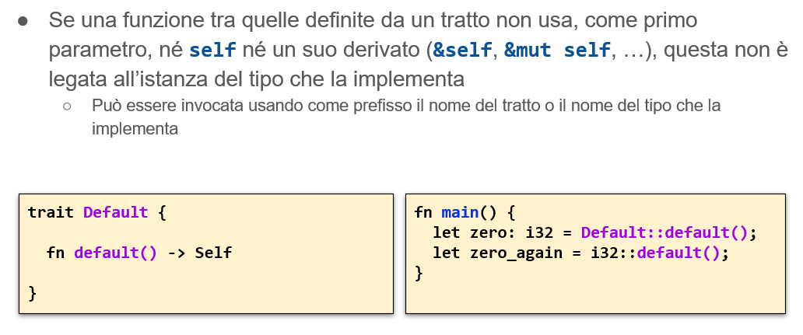
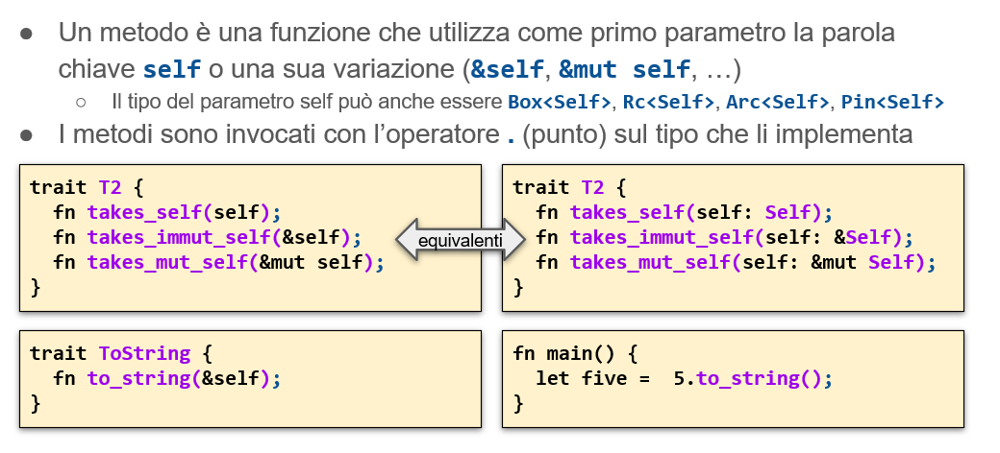
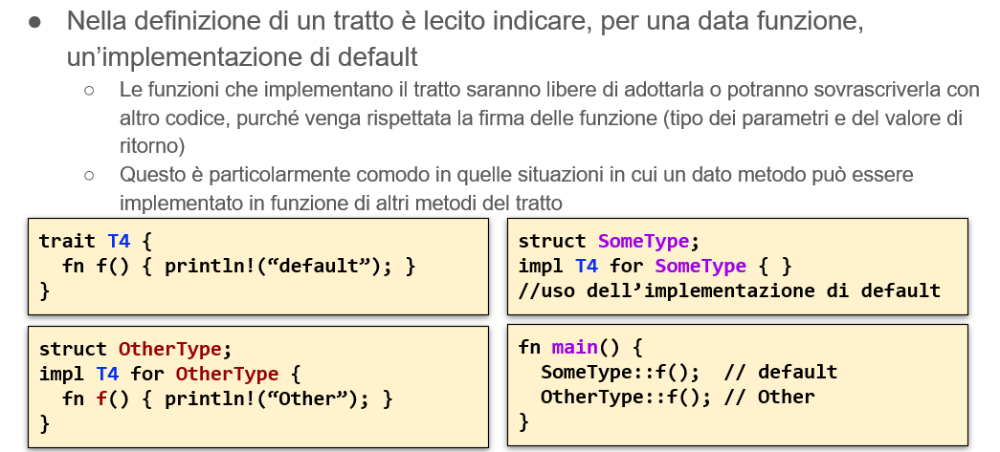
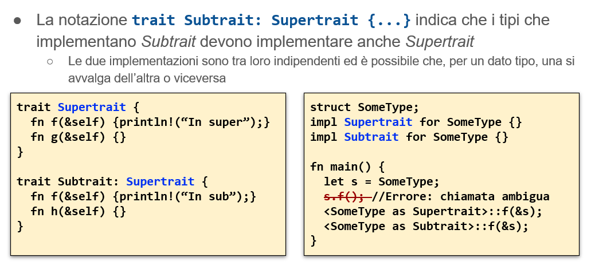

# Polimorfismo
- la necessità di minimizzare il codice scritto spinge verso l’identificazione di pattern comuni
- La soluzione individuata è il **polimorfismo**: capacità offerta dai linguaggi di associare comportamenti comuni ad un insieme di tipi differenti 
- si può implementare con programmazione generica, interfacce o ereditarietà
## Polimorfismo nei vari linguaggi
- in c non c'è supporto sintattico specifico per implementare il polimorfismo
- il linguaggio ***C++*** supporta il concetto di ereditarietà e il concetto di metodo virtuale

# Tratti
- Non c'è l'ereditarietà in rust
- Equivalente in rust delle interfacce di java 
- Un tratto esprime la capacità di un tipo di eseguire una certa funzionalità : 
   - Un tipo che implementa 
    ```rust 
   std::io::Write 
   ``` 
   può scrivere dei byte. 

Un tipo che implementa std::iter::Iterator può produrre una sequenza di valori. Un tipo che implementa std::clone::Clone può creare copie del proprio valore. Un tipo che implementa std::fmt::Debug può essere stampato tramite println!() usando il formato {:?}. 
- A differenza di quanto accade in C++ o Java, se si invoca su un valore una funzione relativa ad un tratto, **non si ha - normalmente - un costo aggiuntivo.**  Né gli oggetti che implementano tratti hanno una penalità in termini di memoria per ospitare il puntatore alla VTABLE ( ad esempio enum non ha vtable). Tale costo si presenta solo quando si crea esplicitamente un riferimento dinamico (**&dyn TraitName**). Serve quando non voglio ritornare una funzione ma un Tratto (ad esempio qua si ritorna qualcosa su cui si potrà scrivere ). In questo caso si ritorna un **fat pointer**

<div style="page-break-after: always;"></div> 

# Definire e usare un tratto
- Si definisce un tratto con la sintassi
```rust
 trait SomeTrait { fn someOperation(&mut self) -> SomeResult; … }
```
- Una struttura dati concreta, come struct od enum, può esplicitamente dichiarare di implementare un dato tratto attraverso il blocco seguente
```rust
impl SomeTrait for SomeType { … } 
```
- Dato un valore il cui tipo implementa un tratto, è possibile invocare su tale valore i metodi del tratto, con la normale sintassi basata sul ‘.’
   - A condizione che il tratto sia stato dichiarato nello stesso crate o che sia stata importato attraverso il costrutto 
 ```rust
         use SomeNamespace::SomeTrait;
 ```
   - Alcuni tratti (come Clone e Iter) non necessitano di essere importati esplicitamente in quanto fanno parte di una porzione di codice della libreria standard (il cosiddetto preludio) che viene importato automaticamente in ogni crate


<div style="page-break-after: always;"></div>

## Definire e usare un tratto

- Self è una metavariabile : si riferisce al tipo che la implementerà


- Non so cosa ritornare : interi ritornano zero, stringhe una stringa vuota
  



-Chi implementa il tratto : deve anche dire cos'è il tipo per lui





