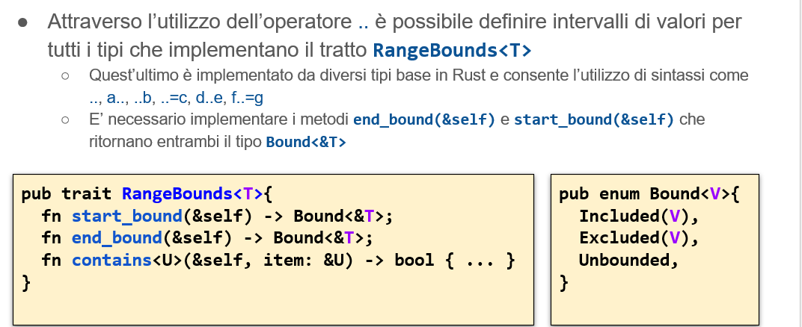

# Invocare un tratto
L'invocazione di un tratto può avvenire in due modalità
- **statica** : se il tipo del valore è noto, il compilatore può identificare l’indirizzo della funzione da chiamare e generare il codice corrispondente senza alcuna penalitàNon c'è overhead ne in termini di tempo di esecuzione ne di memoria allocata
- **dinamica** : se si dispone di un puntatore ad un valore di cui il compilatore sa solo che implementa un dato tratto, occorre eseguire una chiamata indiretta, passando per una VTABLE
  
Variabili o parametri destinati a contenere puntatori (riferimenti, Box, Rc, …) ad un valore che implementa un tratto sono annotati con la parola chiave dyn


```rust
trait Print {
    fn print(&self);
}
struct S {i:32}
impl Print for S {
    fn print(&self){
        println!("S{}", self.i)
    }
}

fn process(v: &dyn Print){ //ricevo un puntatore dinamico
//è un qualcosa che implementa il tratto Print
//senza dyn avrei errore
//dyn è un fat pointer : prima parte replica puntatore vero  (8 byte) e proprio, secondi 8 byte puntatore alla vtable
    v.print();
}

fn main () {
    process(&s{i:o}) //conosco S solo come qualcosa che implementa print : descritta tramite fat pointer
}

```
<div style="page-break-after: always;"></div>

# Vtable oggetti tratto
- I riferimenti/puntatori ai tipi tratto vengono detti oggetti-tratto
Possono essere condivisi o mutabili e devono rispettare le regole dell’esistenza in vita del valore a cui fanno riferimento
- Gli oggetti-tratto vengono implementati tramite fat pointer
- il primo è un puntatore alla funzione drop , il secondo campo contiene la dimensione dell'oggetto a cui stiamo puntando, il terzo elemento indica l'allineamento e poi seguono tanti puntatori quanti sono i metodi definiti dal tratto
  
 
 

# Tratti nella libreria standard
- Usati in rust in modo pesante: definiscono per i tipi presenti nella libreria standard e anche per i custom una serie di utilizzi:
- posso confrontare due oggetti se implementano il  tratto **Eq** o **PartialEq** 
- Per < o <=>,> o >= ecc tratto **Ord**
- Per le somme il tipo di a deve implememntare **ADD** e cosi via...


# Gestire i confronti di uguaglianza
- Implementare un confronto di uguaglianza richiede il rispetto delle proprietà di riflessività, simmetria e transitività
- La relazione di riflessività non vale per numeri con la ",".
  - Ci sono tre valori particolari:
  1. infinite
  2. negative infinite
  3. Nan
   
Questi numeri (1., 2.) sconvolgono i risultati delle operazioni e danno risultati particolari ( es +infinito - infinito => forma indeterminata , 0/0..ecc).\
Nan deve essere diverso da Nan.
Nan composto con le N operazioni da origine a Nan Sempre.
Potrei avere due variabili che hanno la stessa sequenza di bit ma che non devono avere uguaglianza.
Introduciamo il tratto
- **partialeq** : per il caso di riflessività non garantita
- **eq** , sottotratto di partialeq (se implemento eq allora implemento anche partialeq) (tutti i tipi che implementano eq devono implementare partialeq poichè ne è sottotratto)

Ci posso essere diverse implementazioni **DI RIGHT HAND SIDE** : Rhs definisce cosa posso mettere a destra dell'eguale ( di default coincidono). Ha senso anche fare confronti tra due cose diverse (es reale con complesso ).\
Il metodo ne(...) è normalmente preso dalla sua implementazione di default come opposto del risultato di eq(...).
Il tratto eq e partial eq contengono due metodi:
- **eq(&self, other : &RHS) ->bool**,
-  **ne(&self, other : &RHS)**

# Gestire i confronti di ordine
I tratti **PartialOrd e Ord** permettono rispettivamente di definire relazioni d’ordine parziali e totali su un dato insieme di valori

```rust
enum Ordering {
    Less,
    Equal,
    Greater,
}
trait PartialOrd<Rhs = Self>: PartialEq<Rhs> 
where Rhs: ?Sized, {
    fn partial_cmp(&self, other: &Rhs) -> 
       Option<Ordering>;

    // metodi con implementazione di default
    fn lt(&self, other: &Rhs) -> bool;
    fn le(&self, other: &Rhs) -> bool;
    fn gt(&self, other: &Rhs) -> bool;
    fn ge(&self, other: &Rhs) -> bool;
}
/*------------------------------------*/
trait Ord: Eq + PartialOrd<Self> {
  fn cmp(&self,other: &Self) 
                       -> Ordering;
  // implementazione di default
fn max(self, other: Self) -> Self;
fn min(self, other: Self) -> Self;
fn clamp(self, min: Self, max: Self)
                           -> Self;
}
```
- serve coerenza tra i tratti
- i tratti li genera il compilatore con la macro **define**

# Esempio Clion

```rust
use std::cmp::Ordering;
use std::cmp::Ordering::Equal;
#[derive(PartialEq,Eq,PartialOrd,Ord,Debug)] //qua lo fa il compilatore
struct S {
    a : i32,
    b: bool,
}/*
impl PartialEq for S  {
    fn eq(&self, other: &Self) -> bool {
        return self.a==other.a && self.b==other.b;
        //implemento eq : come faccio a dire se sono equali
    }
*/
fn main() {
    let s1=S{a:1, b:true};
    let s2=S{a:2, b: true};

    if s1==s2 {
        println!("sono uguali");
        // println!("{:?} sono uguali {:?}",s1,s2);
        // in console { a: 1, b: true } sono uguali S { a: 1, b: true }
    }
    else {
        println!("sono diversi");
    }
}
```

# Visualizzare i contenuti

- Non si può derivare direttamente display
- Macro come println! e format! consentono di stampare un valore associato al segnaposto {} a condizione che tale valore implementi il tratto Display 
- Tale tratto rappresenta la capacità del tipo di creare una visualizzazione di un proprio valore comprensibile ad un utente finale

- Per poter implementare display: devo implementare
```rust
trait Display {
    fn fmt(&self, f: &mut fmt::Formatter<'_>) -> fmt::Result;
}
//fmt è da implementare a mano
```
# Copia e duplicazione
Il tratto **Clone** indica la capacità di creare un duplicato di un valore dato : stesso contenuto logico ma non di bit.\
Il tratto **Copy** è un sotto-tratto di Clone.\
La presenza del tratto Copy trasforma la semantica delle operazioni di assegnazione: quello che normalmente determina un **movimento**, che rende inaccessibile il valore originale, diventa una copia.
Copy è mutualmente esclusivo con drop
La definizione di copy non include alcun metodo: introduce solo una proprietà. Si basa su memcpy().

# Rilasciare le risorse

Se un tipo implementa il** tratto drop **vuol dire che ha operazioni particolari da eseguire al rilascio.\
E' mutualmente esclusivo con copy.\
Si accompagna alla funzione globale 
```rust
fn drop<T>(_x:T){}
```
essa forza il passaggio di possesso di un valore ad una nuova variabile(_x) che uscirà di scena subito, provocandone la distruzione
# Indicizzare

E' possibile utilizzare un tipo mio come Array tramite Index se si implementano i tratti Index e IndexMut
- l'espressione t[i] viene riscritta come *t.index (i) se si accede in lettura, *t.index_mut(i) se in lettura
```rust
trait Index<Idx> {
    //Accesso al contenuto di un oggetto in lettura
  type Output: ?Sized;
  fn index(&self, index: Idx) -> &Self::Output;
}

trait IndexMut<Idx>: Index<Idx> {
    // //Accesso al contenuto di un oggetto in scrittura
  fn index_mut(&mut self, index: Idx) -> &mut Self::Output;
}

```
<div style="page-break-after: always;"></div>

# Indicizzare una struttura dati
```rust
// Vec<i32> implementa Index<usize, Output = i32>
let vec = vec![1, 2, 3, 4, 5]; //macro per creare un vettore inizializzato con quell'array
let num: i32 = vec[0]; 
let num_ref: &i32 = &vec[0]; 

// Ma implementa anche Index<Range<usize>, Output=[i32]>
assert_eq!(&vec[1..4], &[2, 3, 4]);
```
# Deferenziare un valore
- c'è il tratto **deref**: permette di considerare un tipo qualunque come fosse un puntatore
- uso ***t per deferenziarlo**
- La sintassi *t per un tipo che implementa Deref e che non sia un riferimento né un puntatore nativo equivale a *(t.deref()) e restituisce un valore immutabile di tipo Self::Target
- Analogamente,  se il tratto implementa DerefMut, *t equivale a *(t.deref_mut()) e restituisce un valore mutabile di tipo Self::Target

```rust
trait Deref {
  type Target: ?Sized;
  fn deref(&self) -> &Self::Target;
}

trait DerefMut: Deref {
  fn deref_mut(&mut self) -> &mut Self::Target;
}
```

# Definire un intervallo
- Permette di definire gli estremi di qualcosa


# Conversione tra tipo


- generano un result invece di generare direttamente il tipo T
- si generano dei panic per poi gestire l'errore in caso di errore

- utile se devo trasformare una stringa in qualcosa

<div style="page-break-after: always;"></div>

# Descrivere un errore

# Derive

