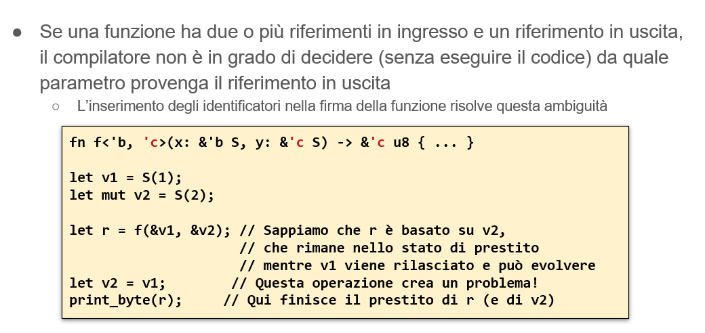
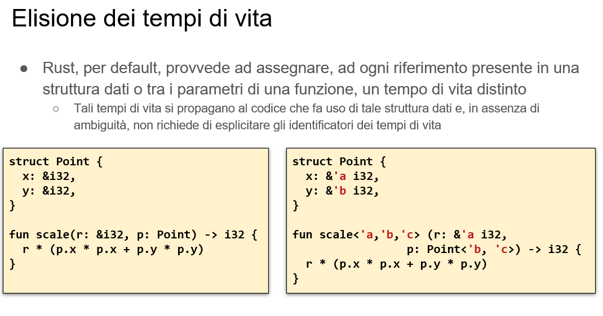

# Lifetime 
- Se una funzione riceve un parametro di tipo riferimento (mutabile o meno), il tempo di vita del riferimento diventa parte integrante della firma della funzione 
- E’ necessario infatti che tutte le operazioni eseguite dalla funzione sul riferimento siano compatibili con la validità del dato memorizzato al suo interno
```rust 
fn f(p: &i32) { … } ⇒ fn f<'a>(p: &'a i32) { … }
//compilatore dice che f è chiamabile solo su funzioni che sono vive
// fn f<'a> la chiama con quel <apice a> dove a è il tempo di vita 
``` 
Il compilatore provvede in molti casi a effettuare autonomamente la riscrittura indicata (lifetime elision).

- Se la funzione riceve più riferimenti, può essere necessario indicare se il loro tempo di vita sia vincolato al più breve o se siano disgiunti
- Nel primo caso si usa un solo identificatore ,  nel secondo si usano etichette diverse 
  
```rust 
  fn f<'a>(p1: &'a i32, p2:&'a i32) { … }
  fn f<'a, 'b>(p1: &'a i32, p2:&'b i32) { … }
  //entrambe raggiungibili nell'intersezioni della vita
```
- Nel caso in cui la funzione sia generica, le meta-variabili di tipo vengono indicate dopo gli identificatori del tempo di vita

# Riferimenti e funzioni

- Uno dei casi più frequenti in cui il compilatore non riesce a dedurre il corretto tempo di vita è legato a funzioni che restituiscono un riferimento, estratto da una delle strutture dati ricevute in ingresso
In tale caso occorre annotare il tipo restituito con la corretta etichetta
``` rust
fn f<'a, 'b>(p1: &'a Foo, p2:&'b Bar) -> &'b i32 { /*…*/ return &p2.y; }
//tempo di vita di b è quello di Bar
```

- Se la funzione memorizza il riferimento ricevuto in ingresso in una struttura dati, il compilatore deduce che il tempo di vita della struttura in cui il riferimento è memorizzato deve essere incluso o coincidente con il tempo di vita del riferimento.
Se questo non avviene, il compilatore identifica l’errore e impedisce alla compilazione di avere successo



- Lo scopo degli identificatori relativi al ciclo di vita è duplice:
  - Per il codice che invoca la funzione (chiamante), essi indicano su quale, tra gli indirizzi in ingresso, è basato il risultato in uscita
  - Per il codice all’interno della funzione (chiamato), essi garantiscono che vengano restituiti solo indirizzi cui è lecito accedere per (almeno) il tempo di vita indicato
- All’atto dell’invocazione, gli identificatori forniti dal programmatore (o inseriti automaticamente dal compilatore, quando possibile) sono legati all’effettivo intervallo minimo (espresso come insieme di linee di codice) nel quale il valore da cui il prestito è stato preso debba restare bloccato per non violare le assunzioni su cui la funzione è basata
   - Tentativi di modificare il valore originale da cui il prestito è preso prima che il tempo di vita sia trascorso portano ad errori di compilazione che costituiscono la base della robustezza del sistema di possesso e prestito offerto da Rust

# Riferimenti e strutture dati
- Lo stesso tipo di ragionamento vale se il dato viene salvato all’interno di una qualsiasi struttura dati
  - Rust verifica che il valore a cui si punta abbia un tempo di vita maggiore o uguale del tempo di vita della struttura dati
  - Questo richiede di esplicitare il tempo di vita della struttura rispetto al tempo di vita dei riferimenti in essa contenuti
- Se una struttura che contiene riferimenti è contenuta, a sua volta, in un’altra struttura, anche quest’ultima deve avere il tempo di vita specificato in modo esplicito

```rust
struct User<'a> {
  id: u32,
  name: &'a str,
}
```
<div style="page-break-after: always;"></div>

```rust
struct Data<'a> { //la stuttura più ampia ha la durata di vita di Uswe
  user: User<'a>,
  password: String,
}
```



- Se una funzione restituisce un riferimento o un tipo che contiene  direttamente o indirettamente - un riferimento, occorre disambiguare il tempo di vita del valore ritornato
  - Se c’è un solo parametro in ingresso dotato di tempo di vita, Rust assume che quello debba essere il tempo di vita del risultato
  - Se sono presenti più parametri in ingresso con tempo di vita, tocca al programmatore esplicitare quale debba essere il tempo di vita da associare al risultato
- Nel caso di metodi che accedono a self tramite un riferimento, Rust assume che il tempo di vita da associare al risultato sia quello del riferimento a self
- Questo parte dal presupposto che se un metodo di un oggetto restituisce un dato preso a prestito (borrow), questo sia stato preso dai dati posseduti dall’oggetto stesso

