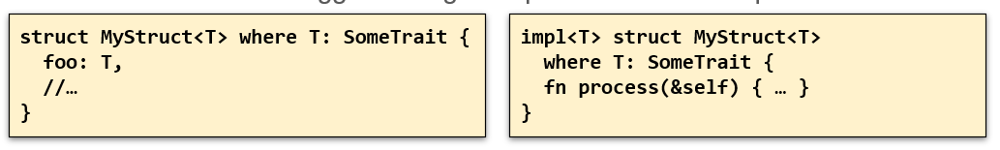
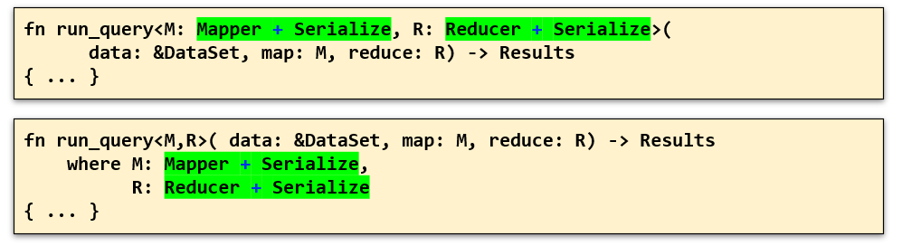

# Funzioni generiche
- Si può definire una funzione in modo che operi su un tipo di dato non ancora precisato
- è una funziona che opera su un tipo al momento non ancora precisato
- T rappresenta un tipo che verrà formulato in un certo momento

```rust
fn max<T>(t1:T, t2: T) -> T where T : Ord {
    return if t1 < t2 { t2}
    else {t1}
}
```
- ci sono vincoli espliciti : T deve essere confrontabile per ordine (deve implementare il tratto Ord)
- Borrow checker si occipa di garantire che se viene passayo un valore questo viene corrattamente gestito dal punto di vista del possesso
- Nel punto in cui una funzione generica viene invocata il compilatore provvede a dedurre cosa deve essere sostituito al segnaposto T per rendere accettabile il codice
- se viene incontrata un'altra chiamata con  lo stesso tipo il compilatore riusa la definizione precedente. Se viene trovata la chiamata ma con un tipo differente viene generata una seconda copia specializzata per il particolare tipo (il processo si chiama **monomorfizzazione** : all'inizio ne ho uno e poi ne ho più copie)
 
# Tipi generici in rust

- in Rust si possono usare costrutti generici per generalizzare i parametri / tipo di ritorno di una funzione o per definire un tipo composto (struct, tupla, enum) basato su parti variabili
- Si definisce una funzione generica basata sulle meta-variabili T, U, V, … indicando tali meta-variabili all’interno di parentesi angolari < > dopo il nome della funzione e prima dell’elenco dei parametri formali
- Ciascuna meta-variabile può essere soggetta ad eventuali restrizioni, indicate come l’insieme dei tratti che deve implementare e/o come il tempo di vita e deve garantire
- Se una struttura generica implementa dei metodi, i nomi delle meta-variabili ed i vincoli cui sono soggette vengono ripetuti nel blocco impl



<div style="page-break-after: always;"></div>

## Tipi generici in generale
 - Quando il compilatore incontra la definizione di tipi / funzioni generici, si limita a verificare formalmente la coerenza del costrutto, senza generare alcun codice
- Se in qualche parte del programma si utilizza un tipo / funzione generico legando le meta-variabili in esso contenute a tipi concreti, il costrutto generico viene istanziato, espandendo la definizione iniziale con i necessari dettagli necessari a generare il codice relativo
- Se il costrutto generico, in parti diverse del programma, è legato a tipi concreti differenti, il compilatore genera ulteriori espansioni della definizione che, pur avendo una matrice comune, risulteranno indipendenti tra loro
Questo processo prende il nome di monomorfizzazione

## Sintassi dei tipi generici
- Rust offre due modi per specificare la sintassi dei vincoli sui tipi generici :
  1. Una versione compatta <T: SomeTrait>
  2. La versione estesa <T> … where T: SomeTrait
- In entrambi i casi, se è necessario indicare che il tipo deve implementare più tratti, questi possono essere combinati con il segno +

- M deve avere il tratto Mapper  e Serializer, R  Reducer e Serialize

<div style="page-break-after: always;"></div>

# Tratti e tipi generici

- Sono legati: esistono tratti generici e funzioni generiche che dipendono da un tratto
```rust 
fn dynamic_process(w: &mut dyn Write) { … }
// opera su un oggetto tratto : opera sulla variabile w che gli è passata come riferimento mutabile ad un oggetto che implementa il tratto w
// w è grande 16byte : contiene un doppio puntatore : 
// un puntatore all'istanza e uno alla vtable del tratto write
//compilata una volta sola, devo per forza passare dalla vtable
fn generic_process<T>(w: &mut T) where T:Write { … }
/* permette di prende in mano qualunque tipo T a patto che implemti il tratto Write */ 
//compilata tante volte quante sono le chiamate
```
- Gli oggetti-tratto richiedono l’uso di fat pointer per permetterne l’accesso ma non richiedono la duplicazione del codice dovuta al processo di monomorfizzazione.
- L’uso di strutture dati generiche, in generale, porta a codice più efficiente  Non solo perché le chiamate alle funzioni non necessitano di transitare per la VTABLE, ma perché il compilatore, conoscendo il tipo concreto in fase di monomorfizzazione, può generare codice più compatto, valutando il risultato dell’elaborazione delle parti costanti in fase di compilazione e sfruttare tecniche di code inlining per ridurre l’impatto dell’invocazione di funzioni
- Non tutti i tratti permettono di definire oggetti-tratto
Occorre infatti che il tratto non definisca alcun metodo statico (ovvero che non utilizza self, &self, …, come primo parametro)
- Non è possibile definire un oggetto-tratto legato a più tratti disgiunti. Mentre è possibile, in una funzione generica, vincolare una meta-variabile ad implementare più tratti
