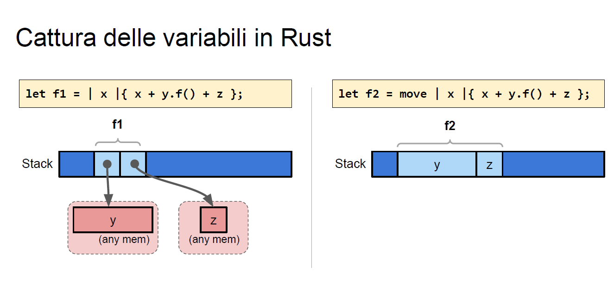
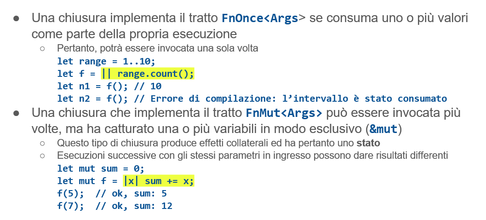
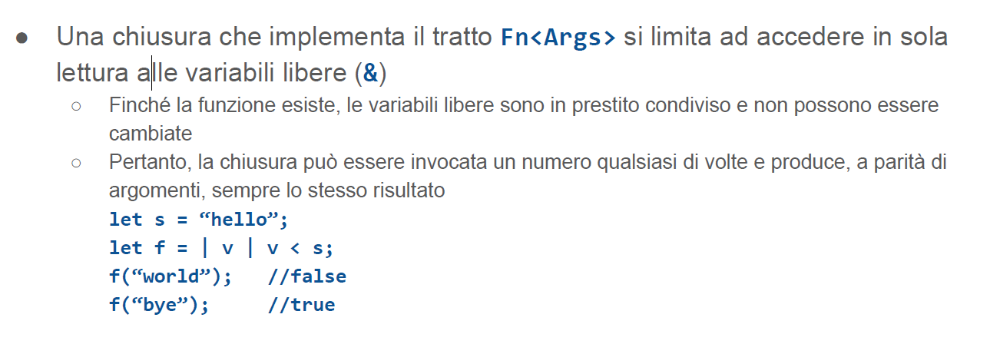
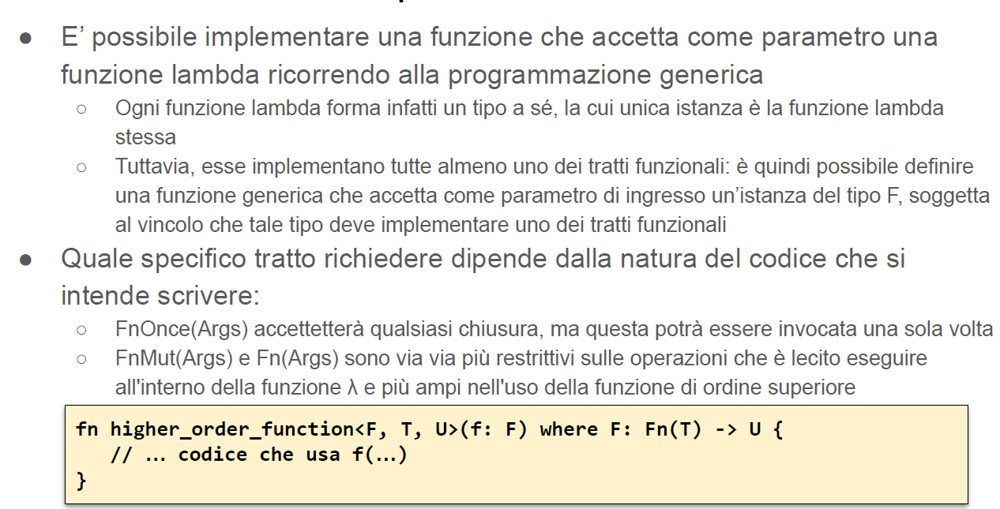
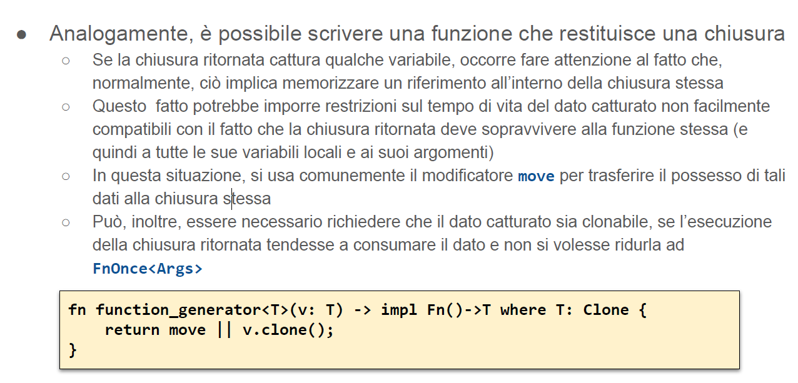

# Funzioni e chiusure

-  introduciamo il concetto di funzione di ordine superiore
- questo richiede la possibilità di trattare una funzione come un tipo dati qualsiasi, consentendo di memorizzarla in una variabile
- In Rust è possibile assegnare ad una variabile il puntatore ad una funzione (che avrà come tipo ***fn(T1, …, Tn) -> U )*** o assegnare un valore che implementa un tratto funzionale: ***FnOnce, FnMut, Fn*** (questi tratti sono implementabili solo usando la notazione lambda )

# Puntatore a funzione
- Qualunque sia la natura del dato assegnato, si utilizza la variabile che
contiene il puntatore come se fosse essa stessa una funzione
   - Sia il tipo di ritorno che tutti i tutti i tipi degli argomenti devono corrispondere a quanto dichiarato nella definizione della variabile (e della funzione)

```rust
fn f1(i: i32, d: f64) -> f64 {
return i as f64 * d;
}
let ptr: fn(i32, f64) -> f64;
ptr = f1; //assegno il puntatore
ptr(2, 3.14); // chiamo la funzione
```


 # Funzioni lambda
 In Rust si racchiudono i parametri formali tra | |:
 ```rust
 let f = | v | { v + 1 }
 ```

 - Una volta definita ed assegnata ad una variabile, una funzione lambda può essere invocata trattando la variabile come se fosse una funzione.
   - Ovvero facendo seguire, al nome della variabile la lista degli argomenti racchiusi in parentesi
tonde: ad esempio, f(5);
-  E’ possibile passare una funzione lambda come argomento di una funzione
da invocare o utilizzare una funzione lambda come valore di ritorno di una
funzione
   - La sintassi con cui si indica il tipo ritornato (una funzione che accetta certi tipi come parametri
e restituisce un certo tipo di valore), a seconda dei linguaggi, può essere più o meno leggibile


<div style="page-break-after : always;"></div>

# Esempio 
```rust 
struct S(i32,bool);

fn create_function(even : bool) -> fn(i32) -> i32 {
    if even {
        return  |i|{i-(i%2)}
    }
    else {
        return |i|{i-i%2+1}
    }
}

fn main() {
   let f1= create_function(true);
    for i in 0..10 {
        println!("f1({}): {}", i, f1(i));
    }

    let f2= create_function(false);
    for i in 0..10 {
        println!("f2({}): {}", i, f2(i));
    }

}

```
#### Nota: catturare una variabile
"Catturare" le variabili in una funzione lambda significa creare una copia o un riferimento alla variabile esterna, in modo che la funzione lambda possa accedere a quella variabile quando viene eseguita in un contesto diverso da quello in cui è stata definita.
In altre parole, le variabili esterne (quelle che vengono catturate) sono accessibili all'interno del corpo della funzione lambda, anche se sono dichiarate al di fuori di essa. La cattura delle variabili consente alla funzione lambda di accedere ai dati esterni, rendendo la funzione stessa più flessibile e riutilizzabile.
In molti linguaggi di programmazione, tra cui C++, Python, Java e JavaScript, le funzioni lambda possono catturare le variabili libere (variabili che non sono dichiarate all'interno della funzione lambda ma sono visibili nel contesto in cui viene definita la funzione). Il modo in cui le variabili sono catturate può variare a seconda del linguaggio, della sintassi e della semantica specifica della funzione lambda.


<div style="page-break-after : always;"></div>

# Chiusure
- Il corpo di una funzione lambda può fare riferimento alle variabili che sono visibili nel contesto in cui è definita, acquisendone un riferimento, una copia o il possesso completo, in base al linguaggio e alla sintassi usata
   -  Tali variabili, che compaiono nel corpo della funzione lambda sono dette **variabili libere**
- La funzione lambda così ottenuta viene detta ***chiusura***
   -  In quanto racchiude, al proprio interno, (una copia) dei valori catturati (quelli contenuti nelle
variabili libere), rendendoli disponibili quando sarà successivamente invocata
-  In Rust, il compilatore trasforma una chiusura in una tupla
   -  Avente tanti campi quante sono le variabili libere
    -  Tale tupla implementa uno dei tratti funzionali previsti dal linguaggio: FnOnce, FnMut, Fn
  
# Cattura delle variabili 
- Per default in Rust, tutte le variabili libere che compaiono nel corpo di una funzione lambda sono catturate per riferimento
  -  Il compilatore, automaticamente, crea un prestito in lettura (**&**)
  - Se occorre modificare il contenuto delle variabili catturate (acquisendole con ***&mut***), occorre
dichiarare la funzione lambda come mutabile (
    ```rust
    let mut f = |...| {...};
    ```
    )
  -  Il borrow checker, come al solito, verifica che tali riferimenti siano coerenti tra loro e con il tempo di vita dei valori cui si riferiscono
- Se occorre, è possibile indicare che la funzione lambda deve acquisire il
possesso dei valori contenuti nelle variabili libere
  - Lo si fa anteponendo alla definizione della funzione lambda la parola chiave move
  ```rust
   let f = move |...| {...};
  ```
  
  - **a sinistra**: usa due variabili libere : x è un parametro (non è un problema), y e z devono essere variabili che esistono nel punto in cui la lambda è definita. Non c'è scritto move: la lambda è costruita come una tupla che contiene due reference( uno a y, uno a z). Il tempo di vita diventa quello della variabile col tempo di vita minore. Potrò usare la lambda fino a che esistono y e z
  - **a destra**: si crea una tupla. La tupla non contiene due reference. Gli oggetti sono stati spostai all'interno.  y e z (vivono nello stack) sono stati ceduti alla lambda (chi le ha definite non vi può più fare accesso).  Lambda con move prende tutto l'oggetto ma non ha problemi con tempi di vita (è proprietaria di y e z). Diventa una chiusura è diventata lei proprietaria esclusiva di quelel variabili che esistevano nel contesto di dove sono state dichiarate

# I tratti funzionali
Rust definisce tre tratti funzionali che possono essere implementati solo tramite chiusure
-    Quale tratto venga implementato, dipende da cosa e come viene catturato
```rust
trait FnOnce<Args> {
type Output;
fn call_once(self, args: Args) -> Self::Output;
}

trait FnMut<Args>: FnOnce<Args> {
fn call_mut(&mut self, args: Args) -> Self::Output;
}

trait Fn<Args>: FnMut<Args> {
fn call(&self, args: Args) -> Self::Output;
}
```


Non siamo noi a dire cosa implementare, dipende da cosa fa il nostro codice (esempio leggo solo allora uso Fn\<Args>)

<div style="page-break-after : always;"></div>

# Funzioni di ordine superiore

