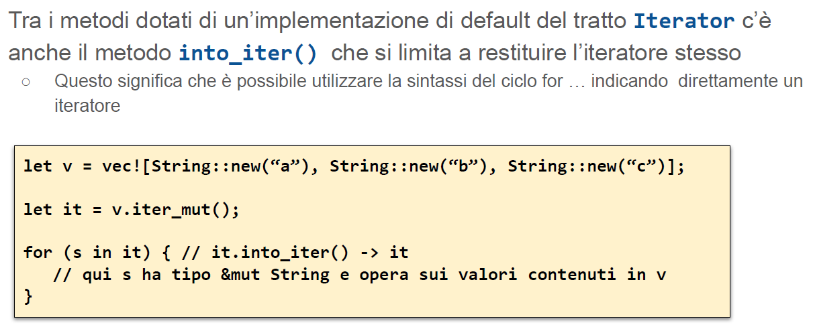
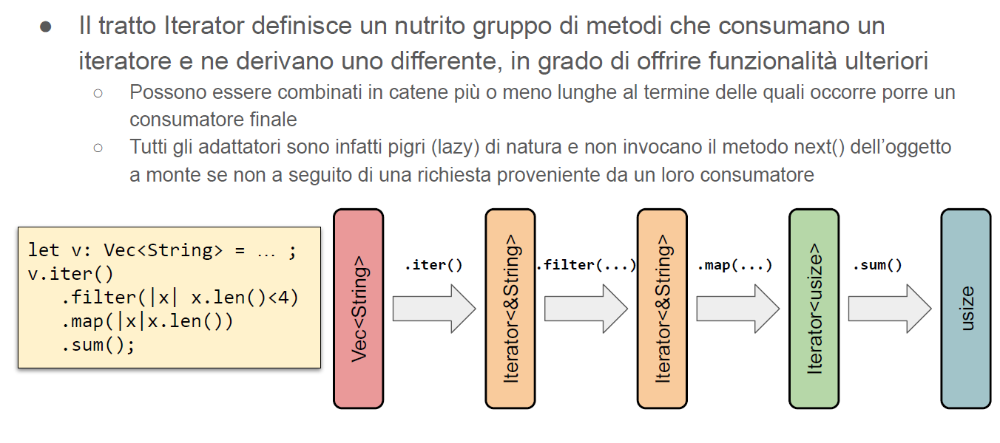

# Iteratori

Un iteratore è **una struttura dati dotata di stato, in grado di generare una sequenza di valori**.  I valori possono essere estratti da un contenitore, di cui l’iteratore detiene un riferimento, o generati programmaticamente, come nel caso di un intervallo di valori.  Pressoché tutti i linguaggi “moderni” offrono il concetto di iteratore come parte
della propria libreria standard. Essi permettono di accedere ai valori contenuti all’interno di collezioni come liste, insiemi, mappe, scorrere i caratteri presenti all’interno di una stringa o leggere il contenuto di un file di testo estraendo una riga alla volta

## Iteratori in rust
In Rust, un iteratore è una qualsiasi struttura dati che implementa il tratto **std::iter::Iterator**
``` rust
trait Iterator{
  type Item;
  fn next(&mut self) -> Option<Self::Item>;  …// altri metodi con implementazione di default
}
``` 
Un tipo può segnalare la capacità di essere esplorato tramite un iteratore, implementando **il tratto std::iter::IntoIterator**
``` rust
trait IntoIterator where Self::IntoIter: Iterator<Item=Self::Item> {
  type Item;
  type IntoIter: Iterator;
  fn into_iter(self) -> Self::IntoIter;
}

``` 

<div style="page-break-after: always;"></div>

## Iteratori e cicli for

Il compilatore trasforma i cicli for in codice basato sugli operatori.
Alla fine la struttura viene distrutta.
Se la struttura non è iterabile viene generato errore.

``` rust
let values = vec![1, 2, 3, 4, 5];
for x in values { println!("{}", x)}; 
// diventa 
let values = vec![1, 2, 3, 4, 5];
{
    let result = match IntoIterator::into_iter(values) {
        mut iter => loop {
            let next;
            match iter.next() {
                Some(val) => next = val,
                // se c'è qualcosa
                None => break,
                // se non c'è niente
            };
            let x = next;
            let () = { println!("{}", x); };
        },
    };
    result
}
``` 


## Iteratori e possesso
I contenitori presenti nella libreria standard mettono normalmente a disposizione tre metodi per ricavare un iteratore ai dati contenuti al loro
interno
- **iter()**, che restituisce oggetti di tipo &Item e non consuma il contenuto del contenitore
- **iter_mut()**, che restituisce oggetti di tipo &mut Item e permette di modificare gli elementi
all’interno del contenitore
- **into_iter()**, che prende possesso del contenitore e restituisce oggetti di tipo Item
estraendoli dal contenitore
- E’ comune, per tali contenitori, dichiarare tre implementazioni distinte del
tratto** IntoIterator**
  -  **Una per il tipo Container vero e proprio**, che richiama il metodo into_iter()
  - **Una per il tipo &Container**, che richiama iter()
  - **Una per il tipo &mut Container**, che richiama iter_mut()
  - In alcuni casi (HashSet< T >, HashMap< T >, …) la terza implementazione non è fornita perché romperebbe le astrazioni


<div style="page-break-after: always;"></div>

## Derivare un iteratore




## Adattatore


