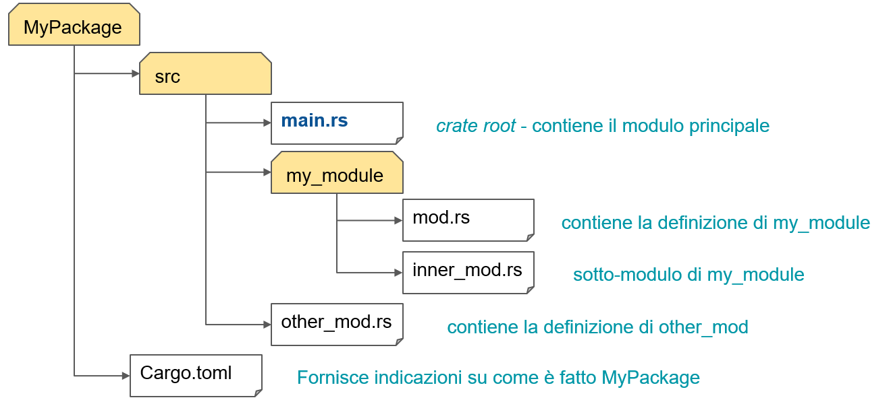
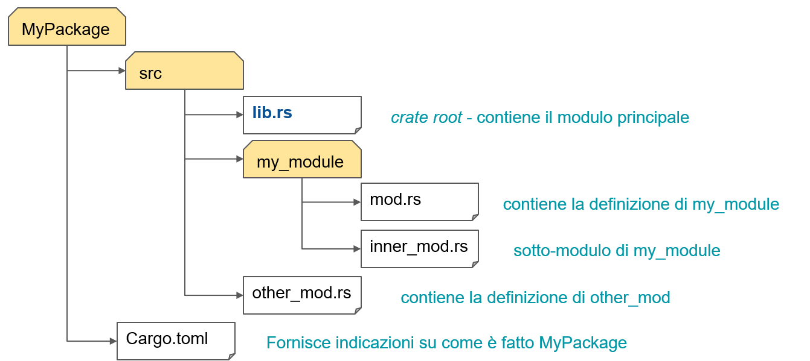
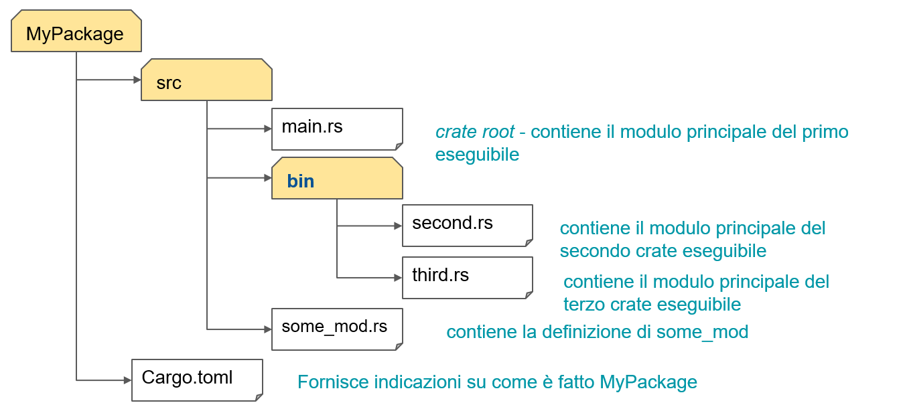

# Terminologia

- **Crate** : unità di compilazione che da origine ad un eseguibile o ad una libreria. Si possono trovare riferimenti a moduli contenuti in ulteriori file sorgenti. Devono essere scaricati e resi parte della compilazione
- **Crate root** : file sorgente usato dal compilatore per creare il modulo principale del crate (un crate binario deriva da src/main.rs, una libreria da src/lib.rsfile)
- **Module** : 
  - è un meccanismo usato epr suddividere gerarchicamente il codice sorgente in unità logiche differenti e regolarne la visibilità reciproca
  - un modulo può contenere funzioni, tipi ed altri moduli 
  - ogni modulo può essere una sezione del file sorgente ,  essere un file sorgente a  se stante (esempio se creo un file ```alpha.rs``` ) o essere memorizzato in una sottocartella della cartella in cui è ospitato il suo contenitore ( cartella ``` alpha``` dove metto ```mod.rs```)
- **Package**: insieme di uno o più crates che costituiscono un progetto. Un package è ospitato in una cartella che contiene il Cargo.toml. Può contenere al massimo una libreria, mentre può contenere più crate binari.

## Struttura di un progetto eseguibile Rust


## Struttura di un prgetto di libreria Rust


## Struttura di un progetto con due o più eseguibili 


# Istruzioni di base

- Per stampare su stdout: **print!(...)** oppure **println!(...)**
Il primo parametro è una stringa di formato: per ciascuna coppia di {} presenti al suo interno deve essere indicato un parametro successivo, il cui contenuto sarà inserito al posto delle graffe
Tutto quello che non sta nelle graffe viene stampato così com’è : ```println!(“Hello, {}!” , “world”); // → Hello, world!```
Per stampare su stderr: ```eprint!(...) oppure eprintln!(...)```
- Si dichiarano le variabili con la parola chiave **let**. 
Nella maggior parte dei casi, il compilatore è in grado di dedurre automaticamente il tipo associato
let x : i32 = 13;
println!("{}", x);
