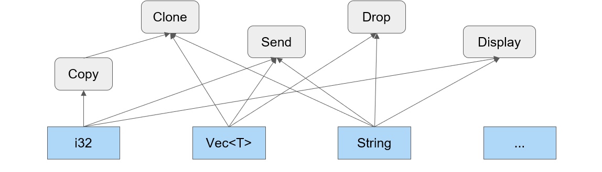

# Il linguaggio

- Una variabile viene definita con **let**
- Rust favorisce l'immutabilirà: una variabile di base è legata ad un solo valore per tutta la sua esistenza. La variabile si può modificare aggiungendo **mut**
- Ad ogni variabile è associato staticamente(per tutta la durata del programma) un **tipo**

## Tipi e tratti

Rust offre diversi tipi predefiniti (elementari, tuple, stringhe, array, slice, diversi tipi di puntatori). È possibile definire anche nuovi tipi sotto forma di struct, enum, union, funzioni, chiusure. I tipi non sono organizzati gerarchicamente: **le proprietà di cui un tipo gode vengono definite dai tratti che esso implementa**. **Un tratto descrive, dunque, un insieme di metodi implementati dal tipo**: somigliano alle interfacce di altri linguaggi, dove esistono metodi vuoti o con implementazione di default (sovrascrivibile). Qualsiasi tipo può implementare zero o più tratti. Rust introduce circa una ventina di tratti predefiniti, i quali possono essere affiancati da tratti custom definiti dal programmatore. 


Dato che i tipi possono implementare tratti comuni , si viene quindi a creare una forma di parententela molto articolata tra i tipi.


## Tuple 
- **Tupla** : è collezione ordinata di valori eterogenei. Si può accedere ad un valore della tupla mediante la notazione puntata
``` rust
let t: (i32, bool) = (123, false); // t è una tupla formata da un intero  e da un booleano
let mut u = (3.14, 2.71);          // u è una tupla riassegnabile formata da due double
let i = t.0; 		       // i contiene il valore 123
u.1 = 0.0;		       // adesso u contiene (3.14, 0.0)       
```

<div style="page-break-after: always;"></div>

## Puntatori e memoria
 Rust offre diversi modi per rappresentare indirizzi in memoria: **riferimenti, box e puntatori nativi** (gli ultimi si possono usare solamente all’interno di un blocco unsafe). L’uso dei puntatori è semplificato grazie alle garanzie offerte dal compilatore che verifica il possesso ed il tempo di vita delle variabili.

 ## Riferimenti
I riferimenti possono essere **condivisi (semplici) o mutabili**. **I riferimenti semplici possono essere copiati**: è possibile avere, dunque, più variabili che prendono in prestito in sola lettura il valore della variabile interessata (fondamentale tenere presente che la mutabilità della variabile coinvolta è congelata finché l’ultimo riferimento semplice viene distrutto). **I riferimenti mutabili, che richiedono ovviamente la mutabilità della variabile, sono unici**: prendono in prestito il valore della variabile e ne permettono la modifica. I riferimenti in Rust non possono mai essere nulli e implementano dunque una logica single writer or multiple readers. 

## Riferimenti : esempio 
- L’espressione ```let r1 = &v;```, dove v è un qualsiasi valore o espressione, definisce ed inizializza il riferimento r1. La variabile r1 prende a prestito (borrows) il valore v e potrà accedervi (in sola lettura) con l’espressione *r1. Un riferimento viene rappresentato internamente come un blocco di memoria contenente l’indirizzo di memoria in cui il valore è memorizzato.
I riferimenti in sola lettura possono essere copiati, assegnandoli ad un’altra variabile o passandoli come parametro ad una funzione: ma fino a che esiste almeno un riferimento ed è in uso, il valore originale non è modificabile.
- L’espressione ```let r2 = &mut v;``` definisce ed inizializza il riferimento mutabile r2.
La variabile r2 prende a prestito, in modo esclusivo, il valore v e permette di modificarlo (ad esempio, scrivendo *r2 = …; ). 
Finché un riferimento mutabile esiste ed è in uso, non è possibile né creare altri riferimenti (mutabili o meno) al valore originale, né accedere in alcun modo al valore originale .


## Borrow checker
E' componente del compilatore in Rust che svolge un ruolo fondamentale nella gestione della memoria e nella prevenzione degli errori legati alle violazioni delle regole di accesso e mutabilità. Si occupa di analizzare il codice sorgente per garantire che i riferimenti rispettino le regole di: **ownership** (un dato può avere un solo proprietario per volta), **borrowing**(mentre un dato è in possesso, è possibile fare dei prestiti, o molteplici immutabili o un unico mutabile) e **lifetime** (un riferimento non può avere un tempo di vita maggiore del proprietario del dato: se ciò dovesse accadere, tutti i riferimenti devono essere distrutti). Dunque, è uno strumento chiave per garantire la sicurezza della memoria senza ricorrere al garbage collector o gestioni manuali della memoria.

<div style="page-break-after: always;"></div>

## Box

Si alloca un oggetto sullo heap usando il tipo generico : Box < T >. Una variabile di questo tipo contiene il puntatore al valore
Si utilizza per :
- prolungare il tempo di vita di un valore oltre quello del blocco sintattico in cui è definito
- i casi in cui non è nota la dimensione del dato da memorizzare

 Si alloca un valore di tipo Box con il costrutto 
- ```let b = Box::new(v);``` dove v è un qualsiasi valore.   
Questa istruzione definisce la variabile b che conterrà un puntatore ad un blocco allocato sullo heap che a sua volta contiene il valore v.
- Si accede al valore contenuto nel blocco con l’espressione ```*b```
- Se la variabile b è definita come mutabile, è possibile modificare il contenuto a cui si punta con l’espressione 
- ```*b = …;```
- Quando l’esecuzione del programma raggiungerà la fine del blocco di codice in cui la variabile b è stata definita (fine del sua visibilità sintattica), il blocco sarà rilasciato a meno che il contenuto di b (il puntatore al blocco) sia stato mosso in un’altra variabile 
- Tendenzialmente occupano 8 byte: se però si punta ad un oggetto il cui tipo non permette di desumere la dimensione, il box conterrà puntatore e dimensione (fat pointer).

# Puntatori nativi 
Non entriamo in dettaglio. Sono messi a disposizione del programmatore, ma vanno usati all’interno di blocchi unsafe.

# Array
- Sequenza di oggetti omogenei disposti consecutivamente nello stack. La dimensione viene definita all’atto della sua creazione ed è definita per tutto il tempo di vita dell’array. 
- Si crea un array racchiudendo la sequenza dei suo valori tra parentesi quadre
- Un array ha tipo [T; length], dove T è il tipo dei singoli elementi, length indica il numero dei valori contenuti
Si accede al contenuto dell’array con la notazione nome[ index ]

```rust
let a: [i32; 5] = [1, 2, 3, 4, 5]; // a è un array di 5 interi
let b = [0; 5];  // b è un array di 5 interi posti  posti a 0
// NOTARE il ; per distinguere le notazioni 
let l = b.len(); // l vale 5
let e = a[3];  // e vale 4                           
```
<div style="page-break-after: always;"></div>

## Slice
E' un riferimento ad una sequenza di valori consecutivi di un array la cui lunghezza non è nota in fase di compilazione bensì in esecuzione. **Una slice è costituita da due valori consecutivi: il puntatore all’inizio della sequenza e il numero di elementi della sequenza (anche in questo caso, dunque, si parla di fat pointer).**
Si può modificare il contenuto della slice se l’array o il vec interessato è mutabile: sarà sufficiente dichiarare la slice come un riferimento mutabile. Anche in questo caso non possono coesistere due riferimenti mutabili allo stesso vec/array, anche se non dovessero sovrapporsi.

## Vec < T >

Il tipo Vec < T > rappresenta una sequenza ridimensionabile di elementi di tipo T, allocati sullo heap. Offre una serie di metodi per accedere al suo contenuto e per inserire/togliere valori al suo interno.
Una variabile di tipo Vec< T > è una tupla formata da tre valori privati: 
- Un puntatore ad un buffer allocato sullo heap nel quale sono memorizzati gli elementi
- Un intero privo di segno che indica la dimensione complessiva del buffer
- Un intero privo di segno che indica quanti elementi sono valorizzati nel buffer

Se si richiede ad un oggetto di tipo Vec< T > di inserire un nuovo elemento, questo verrà memorizzato nel buffer nella prima posizione libera e verrà incrementato l’intero che indica il numero di elementi effettivamente presenti.
Nel caso in cui il buffer fosse già completo, verrà allocato un nuovo buffer di dimensioni maggiori e il contenuto del buffer precedente sarà riversato in quello nuovo, dove verrà poi anche inserito il nuovo elemento , dopodiché il buffer precedente sarà de-allocato.


``` rust
// Esempio di vec 
fn useVec() {
  let mut v:Vec<i32> = Vec::new();
  v.push(2);
  v.push(4);
  let s = &mut v;
  s[1] = 8;
}

```

## Stringhe

Rust offre due modi principali di rappresentare le stringhe : 
- Come array di caratteri (immutabili) con rappresentazione Unicode, memorizzati in un’area statica, rappresentato dal tipo primitivo **str**
- Come oggetti allocati dinamicamente, utilizzando il tipo **String**
  
Le costanti di tipo stringa presenti nel codice sorgente sono racchiuse tra doppi apici **""**.  Il compilatore provvede ad inserirle in un’apposita area statica di memoria, in modo compatto, senza aggiungere alcun terminatore.
Poiché il tipo primitivo str non è direttamente manipolabile, si accede ad esso **solo tramite uno slice**, di tipo  &str.
Esso contiene l’indirizzo del primo carattere e la lunghezza della stringa.

 Per questa sua struttura, gli oggetti di tipo &str possono referenziare sia str veri e propri, sia i buffer allocati dinamicamente all’interno del tipo String e, per questo, costituiscono il fondamento dell’interoperabilità tra i due formati.

Gli oggetti di tipo String contengono **un puntatore ad un buffer allocato dinamicamente, l’effettiva lunghezza della stringa e la capacità del buffer**.
Se la stringa è mutabile e vengono inseriti al suo interno più caratteri di quelli che il buffer può contenere, il buffer viene automaticamente ri-allocato con una capacità maggiore, così da ospitare quanto richiesto.
Tutti i metodi che sono leciti su un oggetto di tipo &str sono anche disponibili per &String.
Inoltre, se una funzione accetta un parametro di tipo &str, è possibile passare come argomento corrispondente il riferimento ad un oggetto String

### Operazioni sulle stringhe

- Si crea un oggetto String con le istruzioni 
``` rust
let s0 = String::new(); //crea una stringa vuota
let s1 = String::from(“some text”); //crea una stringa inizializzata
let s2 = “some text”.to_string(); //equivalente al precedente
```
- Si ricava un oggetto di tipo &str da un oggetto String con il metodo
``` rust
s2.as_str();
```
- Un oggetto String (se mutabile) può essere modificato
``` rust
s3.push_str(“This goes to the end”); // aggiunge al fondo
s3.insert(0, “This goes to the front”); // inserisce alla posizione data
s3.remove(4); // elimina il carattere alla posizione indicata
s3.clear();  // svuota la stringa
```
- In altri casi si può costruire un altro oggetto String 
``` rust
let s4 = s1.to_uppercase();// forza il maiuscolo (ATTENZIONE alla lingua!)
let s5 = s1.replace(“some”, “  more ”); // sostituisce un blocco 
let s6 = s1.trim(); // elimina spaziature iniziali e finali
``` 

<div style="page-break-after: always;"></div>


## Le funzioni 

Costituiscono il nucleo principale attorno al quale viene definito il comportamento di un programma . **Una funzione è introdotta dalla parola chiave fn seguita dal nome e dalla lista di argomenti, ciascuno con il relativo tipo, racchiusa tra parentesi tonde**.  Se ritorna un valore diverso da (), la lista degli argomenti è seguita dal simbolo **-> e dal tipo ritornato**.  Il corpo della funzione è racchiuso tra { } ed è composto da istruzioni. 
L’ultima espressione presente nel corpo, se priva di ‘;’ finale, viene interpretata come valore di ritorno. 
In alternativa, è possibile utilizzare l’istruzione return seguita dal valore e da ;.

```rust 
fn add_numbers(x: i32, y: i32) -> i32 {
    x + y
}

```

## Istruzioni ed espressioni
Il corpo di una funzione è costituito da istruzioni e/o espressioni separate da **;**. 
Una istruzione ha come tipo di ritorno (), un’espressione può restituire un tipo arbitrario. 
- I costrutti **let …**  e **let mut …** sono istruzioni : creano un legame tra la variabile indicata ed il valore assegnato. 
- Un blocco racchiuso tra **{...}** è un’espressione. Restituisce il valore corrispondente all’ultima espressione, a condizione che non sia terminata da ;

- Il costrutto **if … else …** è un’espressione : il ramo positivo ed il ramo negativo sono costituiti da blocchi che devono restituire lo stesso tipo di dato. 
- Il costrutto **loop …** è un’espressione : crea un iterazione infinita che può essere interrotta eseguendo l’istruzione **break** seguita dal valore di ritorno (se presente). Una singola iterazione può essere parzialmente saltata eseguendo l’istruzione **continue**

E’ possibile annidare più costrutti di tipo loop ed interrompere o continuare un particolare livello di annidamento, facendo precedere l’istruzione loop da un’etichetta :
- L’etichetta è un identificatore preceduto da '
- Le istruzioni break e continue possono indicare l’etichetta cui fanno riferimento
  
L’istruzione **while …** permette di subordinare l’esecuzione del ciclo al verificarsi di una condizione in modo analogo a quanto avviene in altri linguaggi.

L’istruzione  ha una sintassi particolare:
- **for var in expression { code }** , expression deve restituire un valore che sia (o possa essere convertito in) un iteratore: sono leciti, ad esempio, array, slice e range (nella forma low..high)


<div style="page-break-after: always;"></div>

```rust 
//esempio
fn main() {
    'outer: loop {
        println!("Entrato nel ciclo esterno");
        'inner: loop {
            println!("Entrato nel ciclo interno");
            // La prossima istruzione interromperebbe il ciclo interno
            //break;
            // Così si interrompe il ciclo esterno
            break 'outer;
        }
        //Il programma non raggiunge mai questa posizione
    }
    println!("Terminato il ciclo esterno);
}

```
## Intervalli

Le notazioni **a..b** e **c..=d** indicano, rispettivamente, un intervallo semi-aperto e un intervallo chiuso  .
Possono essere usati in senso generale, riferendosi al dominio del tipo della variabile oppure possono essere applicati ad una slice, riferendosi all’insieme dei valori leciti.
Sono possibili diverse  combinazioni :
- **..** indica tutti i valori possibili per un dato dominio
- **a..** indica tutti i valori a partire da a (incluso)
- **..b** indica tutti i valori fino a b (escluso)
- **..=c** indica tutti i valori fino a c (incluso)
- **d..e** indica tutti i valori tra d (incluso) ed e (escluso)
- **f..=g** indica tutti i valori tra f e g (inclusi)

## Esempi di for

```rust
fn main() {
    for n in 1..10 {      // Stampa i numeri da 1 a 9
        println!(“{}”, n); 
    }
    let names = ["Bob", "Frank", "Ferris"];
    for name in names.iter() {  	           // Stampa i tre nomi
        println(“{}”, name);
    }
    for name in &names[ ..=1 ] {  	           // Stampa i primi due nomi
    println(“{}”, name);
    }
    for (i,n) in names.iter().enumerate() {     //stampa indici e nomi
   println!("names[{}]: {}", i, n);
    }
}
```
## L'espressione match

L’espressione **match …** permette di eseguire in modo condizionale blocchi di codice confrontando un valore con una serie di pattern alternativi. 
Essa confronta la struttura del valore con i singoli pattern indicati. 
Tali pattern possono contenere variabili, che - in caso di corrispondenza delle parti costanti - vengono legate al corrispondente frammento del valore confrontato. 
L’elenco dei pattern deve essere esaustivo del dominio dell’espressione
Ciascun pattern è separato dal blocco di codice da eseguire dal simbolo **=>**. 
Il pattern può essere annotato con una clausola **if …** per limitarne l’applicabilità. I diversi rami sono separati da **,**. 
Le espressioni di confronto contenute nel pattern possono essere annotate con un identificatore seguito da **@**, per legare il valore confrontato al nome dato, così da poter fare riferimento ad esso nel blocco corrispondente..

L’espressione match offre una sintassi concisa e sofisticata per confrontare valori multipli così come per estrarre valori da tipi complessi. 
- Per indicare un singolo valore, non occorre nessun operatore.
- La sintassi **val1 ..= val2** indica un intervallo chiuso.
- Una barra verticale singola **|** può essere usata per indicare una disgiunzione (or)
- Il segno di sottolineatura _ corrisponde a qualsiasi valore
- 
I pattern sono valutati nell’ordine indicato
Alla prima corrispondenza, viene valutato il blocco associato, il cui valore diventa il valore dell’espressione complessiva.

```rust 
let s = match item { 
    0 => "zero",	 		                   // valore singolo
    10 ..= 20 => "tra dieci e venti",                   // intervallo inclusivo
    40 | 80 => "quaranta o ottanta",                    // alternativa
    _ =>  "altro",                                      // qualunque cosa
}

```

## Riga di comando
I parametri si trovano dentro il contenitore **std::env::args**. I valori sono di tipo String. **args.len()** ritorna il numero di parametri.

```rust
use std::env::args;
fn main() {

    ...
    let args: Vec<String> = args.skip(1).collect();
    if args.len() >0 { //ci sono gli argomenti
    ..
    }
}
```

## Clap 

La libreria **clap** gestice in modo dichiarativo i parametri passati attraverso la linea di comando. 
La si include in un crate aggiungendo nel file Cargo.Toml una dipendenza del tipo [depencies] clap ={ version= "4.1.4", features = ["derive"]}.

```rust
use clap:: Parser;

#[derive (Parser, Debug)]
#[command(version,long_about = None)]
struct Args {
    //Name of the person to greet
    #[arg(short,long)]
    name : String,
    //Number of times to greet
    #[arg(short,long,default_value_t = 1)]
    count : u8,
}

fn main () {
    let args = Args::parse();
    for _ in 0..args.count {
        println!("Hello {}!", args.name)
    }
}


$ demo --help

Usage : demo[EXE] [OPTIONS] --name <NAME>

Options :

-n, --name <NAME> Name of the person to greet
-c, --count <COUNT> Number of times to greet

$ demo --name ME
Hello Me!
```
<div style="page-break-after: always;"></div>

## I/O da console

Il crate **std::io** contiene la definizione delle strutture dati per accedere ai flussi standard di ingresso/uscita. Questo tipo di operazioni può fallire e di conseguenza tutti i metodi offerti restituiscono un oggetto di tipo **Result < T,Error >** , che incapsula il valore atteso se l'operazione ha avuto successo o un oggetto di tipo Error in caso di fallimento. Per garantire la correttezza del programma occorre gestire esplicitametne l'eventuale errore, verificando il contenuto del valore ritornato tramite il metodo **is_ok()**
Oppure causare l'interruzione forzata del programma in caso di errore utilizzando il metodo **unwrap** che restituisce , se non c'è stato errore il valore incapsulato,
Per semplificare le operazioni di scrittura sono disponibili le due macro **print!(...)** e **println!(...)**. Entrambe accettanno una stringa di formato e una serie di parametri da stampare.

```rust

use std::io;

fn main(){
    let mut s = String::new();
    if io::stdin().read_line(&mut s ).is_ok(){
        println!("Got {}",s.trim());
    }
    else {
        println!("Failed to read line!");
    }
    // alternativamente
    io::stdin().read_line(&mut s).unwrap();
    println!("Got {}",s.trim());
}


```


