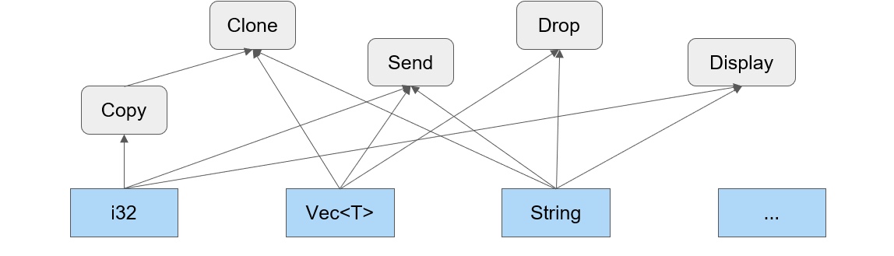

# Il linguaggio

- Una variabile viene definita con **let**
- Rust favorisce l'immutabilirà: una variabile di base è legata ad un solo valore per tutta la sua esistenza. La variabile si può modificare aggiungendo **mut**
- Ad ogni variabile è associato staticamente(per tutta la durata del programma) un **tipo**

## Tipi e tratti

Rust offre diversi tipi predefiniti (elementari, tuple, stringhe, array, slice, diversi tipi di puntatori). È possibile definire anche nuovi tipi sotto forma di struct, enum, union, funzioni, chiusure. I tipi non sono organizzati gerarchicamente: **le proprietà di cui un tipo gode vengono definite dai tratti che esso implementa**. **Un tratto descrive, dunque, un insieme di metodi implementati dal tipo**: somigliano alle interfacce di altri linguaggi, dove esistono metodi vuoti o con implementazione di default (sovrascrivibile). Qualsiasi tipo può implementare zero o più tratti. Rust introduce circa una ventina di tratti predefiniti, i quali possono essere affiancati da tratti custom definiti dal programmatore. 


Dato che i tipi possono implementare tratti comuni , si viene quindi a creare una forma di parententela molto articolata tra i tipi.


## Tuple 
- **Tupla** : è collezione ordinata di valori eterogenei. Si può accedere ad un valore della tupla mediante la notazione puntata
``` rust
let t: (i32, bool) = (123, false); // t è una tupla formata da un intero  e da un booleano
let mut u = (3.14, 2.71);          // u è una tupla riassegnabile formata da due double
let i = t.0; 		       // i contiene il valore 123
u.1 = 0.0;		       // adesso u contiene (3.14, 0.0)       
```

## Puntatori e memoria
 Rust offre diversi modi per rappresentare indirizzi in memoria: **riferimenti, box e puntatori nativi** (gli ultimi si possono usare solamente all’interno di un blocco unsafe). L’uso dei puntatori è semplificato grazie alle garanzie offerte dal compilatore che verifica il possesso ed il tempo di vita delle variabili.

 ## Riferimenti
I riferimenti possono essere **condivisi (semplici) o mutabili**. **I riferimenti semplici possono essere copiati**: è possibile avere, dunque, più variabili che prendono in prestito in sola lettura il valore della variabile interessata (fondamentale tenere presente che la mutabilità della variabile coinvolta è congelata finché l’ultimo riferimento semplice viene distrutto). **I riferimenti mutabili, che richiedono ovviamente la mutabilità della variabile, sono unici**: prendono in prestito il valore della variabile e ne permettono la modifica. I riferimenti in Rust non possono mai essere nulli e implementano dunque una logica single writer or multiple readers. 

## Riferimenti : esempio 
- L’espressione ```let r1 = &v;```, dove v è un qualsiasi valore o espressione, definisce ed inizializza il riferimento r1. La variabile r1 prende a prestito (borrows) il valore v e potrà accedervi (in sola lettura) con l’espressione *r1. Un riferimento viene rappresentato internamente come un blocco di memoria contenente l’indirizzo di memoria in cui il valore è memorizzato.
I riferimenti in sola lettura possono essere copiati, assegnandoli ad un’altra variabile o passandoli come parametro ad una funzione: ma fino a che esiste almeno un riferimento ed è in uso, il valore originale non è modificabile.
- L’espressione ```let r2 = &mut v;``` definisce ed inizializza il riferimento mutabile r2.
La variabile r2 prende a prestito, in modo esclusivo, il valore v e permette di modificarlo (ad esempio, scrivendo *r2 = …; ). 
Finché un riferimento mutabile esiste ed è in uso, non è possibile né creare altri riferimenti (mutabili o meno) al valore originale, né accedere in alcun modo al valore originale .


## Borrow checker
E' componente del compilatore in Rust che svolge un ruolo fondamentale nella gestione della memoria e nella prevenzione degli errori legati alle violazioni delle regole di accesso e mutabilità. Si occupa di analizzare il codice sorgente per garantire che i riferimenti rispettino le regole di: **ownership** (un dato può avere un solo proprietario per volta), **borrowing**(mentre un dato è in possesso, è possibile fare dei prestiti, o molteplici immutabili o un unico mutabile) e **lifetime** (un riferimento non può avere un tempo di vita maggiore del proprietario del dato: se ciò dovesse accadere, tutti i riferimenti devono essere distrutti). Dunque, è uno strumento chiave per garantire la sicurezza della memoria senza ricorrere al garbage collector o gestioni manuali della memoria.

## Box

Si alloca un oggetto sullo heap usando il tipo generico : Box < T >. Una variabile di questo tipo contiene il puntatore al valore
Si utilizza per :
- prolungare il tempo di vita di un valore oltre quello del blocco sintattico in cui è definito
- i casi in cui non è nota la dimensione del dato da memorizzare

 Si alloca un valore di tipo Box con il costrutto 
- ```let b = Box::new(v);``` dove v è un qualsiasi valore.   
Questa istruzione definisce la variabile b che conterrà un puntatore ad un blocco allocato sullo heap che a sua volta contiene il valore v.
- Si accede al valore contenuto nel blocco con l’espressione ```*b```
- Se la variabile b è definita come mutabile, è possibile modificare il contenuto a cui si punta con l’espressione 
- ```*b = …;```
- Quando l’esecuzione del programma raggiungerà la fine del blocco di codice in cui la variabile b è stata definita (fine del sua visibilità sintattica), il blocco sarà rilasciato a meno che il contenuto di b (il puntatore al blocco) sia stato mosso in un’altra variabile 
- Tendenzialmente occupano 8 byte: se però si punta ad un oggetto il cui tipo non permette di desumere la dimensione, il box conterrà puntatore e dimensione (fat pointer).

# Puntatori nativi 
Non entriamo in dettaglio. Sono messi a disposizione del programmatore, ma vanno usati all’interno di blocchi unsafe.

# Array
- Sequenza di oggetti omogenei disposti consecutivamente nello stack. La dimensione viene definita all’atto della sua creazione ed è definita per tutto il tempo di vita dell’array. 
- Si crea un array racchiudendo la sequenza dei suo valori tra parentesi quadre
- Un array ha tipo [T; length], dove T è il tipo dei singoli elementi, length indica il numero dei valori contenuti
Si accede al contenuto dell’array con la notazione nome[ index ]

```rust
let a: [i32; 5] = [1, 2, 3, 4, 5]; // a è un array di 5 interi
let b = [0; 5];  // b è un array di 5 interi posti  posti a 0
// NOTARE il ; per distinguere le notazioni 
let l = b.len(); // l vale 5
let e = a[3];  // e vale 4                           
```

## Slice
E' un riferimento ad una sequenza di valori consecutivi di un array la cui lunghezza non è nota in fase di compilazione bensì in esecuzione. **Una slice è costituita da due valori consecutivi: il puntatore all’inizio della sequenza e il numero di elementi della sequenza (anche in questo caso, dunque, si parla di fat pointer).**
Si può modificare il contenuto della slice se l’array o il vec interessato è mutabile: sarà sufficiente dichiarare la slice come un riferimento mutabile. Anche in questo caso non possono coesistere due riferimenti mutabili allo stesso vec/array, anche se non dovessero sovrapporsi.
