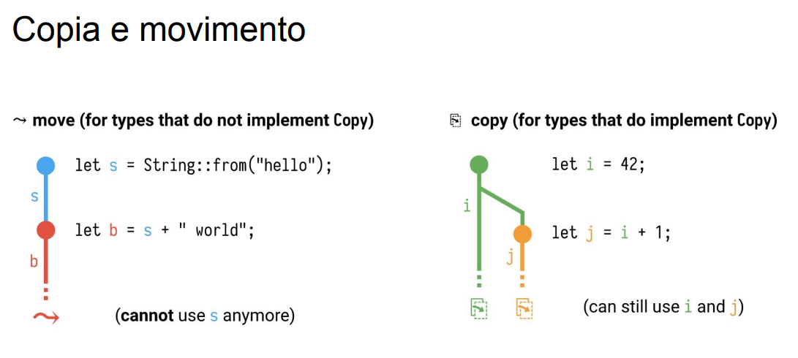
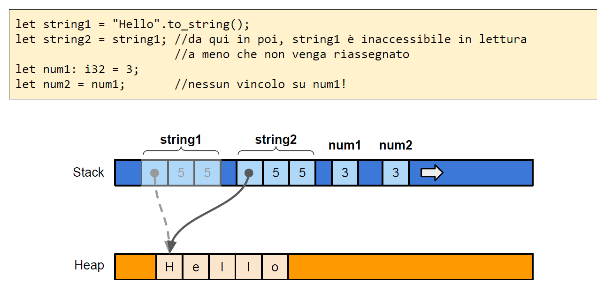
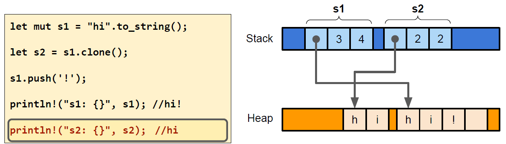
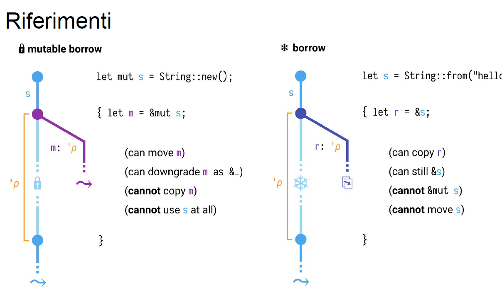
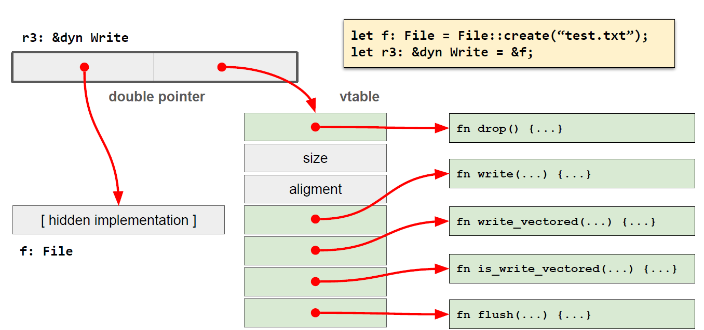
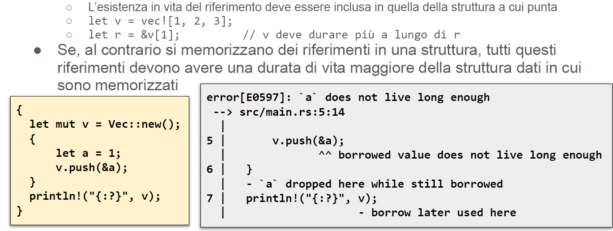
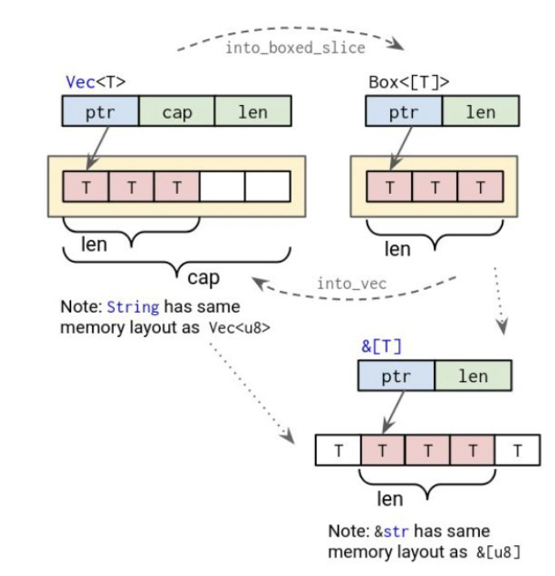
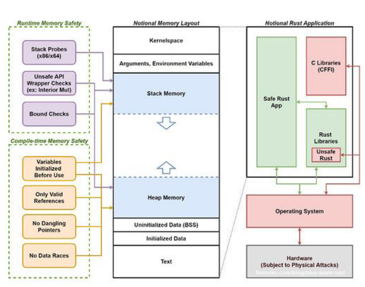

# Onwership

1. In rust ogni valore introdotto nel programma è posseduto da una e una sola variabile.
Un particolare blocco logico contenuto nel compilatore detto ***borrow checker*** verifica formalmente questo fatto, per ogni punto dell'esecuzione del programma.
Ogni violazione porta ad un ***fallimento della compilazione***.
2. Possedere un valore vuol dire essere responsabile del suo ***rilascio***. Quando la variabile cessa di esistere allora il valore viene rilasciato.
3. Il rilascio avviene quando la variabile che lo possiede esce dal proprio scope sintattico o quando le viene assegnato un nuovo valore. Si possono associare azioni da eseguire prima che sia liberata la memoria grazie ad un meccanismo di nome ***drop***.
Il rilascio può essere rimandato a dopo se il contenuto della variabile viene trasferito in un'altra variabile (***movimento***): in questo caso la nuova variabile diventa responsabile del suo rilascio.


# Movimento

Quando una variabile viene inizializzata, prende possesso del relativo valore. Se ad una variabile (mutabile) è assegnato un nuovo valore, quello precedentemente posseduto viene rilasciato e la variabile diventa proprietaria del nuovo valore. 
Se una variabile viene assegnata ad un’altra variabile oppure passata come argomento ad una funzione, il suo contenuto viene MOSSO nella destinazione. 
**La variabile originale cessa di possedere il valore (non ne è più responsabile) ed il possesso passa alla variabile destinazione (o al parametro della funzione invocata).** 
La variabile originale resta allocata fino a quando non termina la sua visibilità (chiusura del blocco in cui è stata definita).
Eventuali accessi in lettura alla variabile originale porteranno ad errori di compilazione. Eventuali accessi in scrittura alla variabile originale avranno successo e ne riabiliteranno la lettura.
La variabile destinazione conterrà una copia bit a bit del valore originale (ammesso che il compilatore non riesca a riusare i dati originali al loro posto)


# Copia

Alcuni tipi tra cui quelli numerici sono copiabili: implementano il tratto ***copy***. Quando un valore viene assegnato ad un’altra variabile o usato come argomento in una chiamata a funzione, il valore originale rimane accessibile in lettura.
I tipi semplici e le loro combinazioni (tuple e array di numeri, ad esempio) sono copiabili così come sono copiabili i riferimenti a valori non mutabili. I riferimenti a valori mutabili NON sono copiabili.
Da un punto di vista del codice generato, non cambia nulla tra copia e movimento. L’istruzione di assegnazione o il passaggio come argomento comporta la duplicazione (bit a bit) del valore originale. 
**Semplicemente, in caso di copia, il borrow checker non impedisce l’ulteriore accesso in lettura al dato originale**.
Il tratto copy e il tratto drop sono mutualmente esclusivi: un tipo droppable non può essere copiabile e viceversa.


 

 1. Meccanismo del movimento avviene quando c'è un consumo.
 S+world == invocazione di concat() : consuma la stringa s perchè al trasforma: ora s è inaccessibile ( ha ceduto il suo valore per fare copia). Ad s non accedo più
 1. i non viene consumato : è ancora accessibile  (i e j hanno vita indipedendente).

 

<div style="page-break-after: always; break-after: page;"></div>

# Clonazione

I tipi che implementano il tratto ***Clone()*** possono essere duplicati invocando il metodo **clone()**.
Il tratto copy può essere assegnato solo a chi implementa già tratto clone().
A differenza della copia e del movimento, la clonazione può comportare una copia in profondità dei valori
Di conseguenza, il costo della clonazione può essere elevato.L'implementazione dell'operazione di clonazione è modificabile dal programmatore
L'implementazione di copia e movimento, invece, è sotto il controllo esclusivo del compilatore ed è basata sull'invocazione della funzione memcpy(...).
Ad esempio prima la parte dello heap è rimasta tale e quale: con s1.clone() avrei duplicato in profondità la struttura con la creazione di un nuovo buffer. La copia semplice non comporta nulla sulle risorse. La clonazione è un'operazione molto più onerosa.

Qua con il clone ho un nuovo heap.
Una stringa può essere clonabile senza essere copiabile. Per gli interi clona e copia sono la stessa cosa.
Copy() necessita clone() il contrario non vale.
 


<div style="page-break-after: always; break-after: page;"></div>


# Riferimenti
Rust introduce diverse forme di puntatori: **un riferimento è un puntatore in sola lettura ad un blocco di memoria posseduto da un'altra variabile**.
Permette di accedere ad un valore senza trasferirne le proprietà. Il riferimento può esistere solo mentre esiste la variabile che possiede il dato a cui punta. Il compilatore deferenzia automaticamente il puntatore quando si accede ad una variabile tramite l'operatore '.'
``` rust 
let point = (1.0, 0.0); //point possiede il valore
let reference = &point; //reference PUÒ accedere al valore in lettura
 //finché esiste point
println!(“({}, {})”, reference.0, reference.1);
```
## Riferimenti e prestiti

1. Un riferimento ***prende a prestito*** l'indirizzo di memoria in cui esiste il valore (finchè il riferimento è accessibile non è possibile modificare il valore ne tramite il riferimento ne tramite la variabile che possiede il valore).
2. E' possibile creare più riferimenti per una variabile. **I riferimenti sono copiabili**: viene duplicato il puntatore.
Il compilatore garantisce che un riferimento punti sempre ad un dato valido.Finchè esiste almeno un riferimento il dato originale non potrà ne essere modificato ne distrutto.

## Riferimenti mutabili

A partire da una variabile che possiede un valore è possibile estrarre UN SOLO *** riferimento mutabile*** per volta. Si crea un riferimento mutabile con 
```rust 
let r = &mut v;
```
I riferimenti mutabili non sono copiabili: in caso di assegnazioni o simili avviene il movimento.
E' possibile creare un riferimento mutabile solo se in partenza la variabile era mutabile




Le {} introducono un blocco. s è dichiarato prima come mutabile
1. A sinistra mutable borrow: 
- m è un puntatore allo stack che posso dichiarare mutabile.
Posso fare operazioni con m che alterano s.
Posso muoverlo cedendolo ad un altro, anche ridurlo a ref semplice ma perdo le proprietà. Non posso copiare m e non posso usare in ogni modo s.
Alla fine delle graffe s torna pienamente padrone e fa quello di cui ha bisogno.
Insieme di righe in cui non è accessibile è rho.

2. A Destra riferimento semplice:
- posso copiare r , non posso muovere e non posso renderlo modificabile

## Riferimenti in memoria

I riferimenti in base a che cosa puntano possono essere grandi 8 o 16 byte.
Se puntano a tipo completamente noto sono grandi 8 byte, quando i riferimenti puntano ad un dato non deducibile dal tipo (esempio: uno slice) allora è un fat pointer (8 di puntatore e 8 di size)
Quando non ne conosco il tipo ma solo il tratto allora un reference è grande 16 byte (ma sono due puntatori): uno all'oggetto e uno che punta a una zona detta wtable (è condivisa da tutti gli oggetti di un particolare tipo. E' una tabella che contiene tutti i puntatori ai metodi che quel tratto offre)



Ad esempio qua il tratto write dice che posso scriverci sopra. &din dice che è un puntatore doppio.

r3 è marcata come oggetto che implementa il tratto write : più avanti posso riassegnarla(non posso fare assunzioni su cosa sia).
r3 contiene dentro di se due puntatori: 1 allo struct vera e propria, il secondo alla wtable (oggetto costruito dal compilatore che contiene i puntatori veri alle funzione che implementano il tratto write. La vtable è unica per ogni tipo).
Esiste una vtable per ogni tipo e per ogni tratto.
SIZE mi dice la grandezza della struttura a cui sta puntando . aligment l'allineamento della memoria. Ci sono tante entry tante quante sono le funzioni che il tratto definisce.

<div style="page-break-after: always; break-after: page;"></div>

## I riferimenti in memoria : sommario
I riferimenti sono implementati diversamente sulla base del tipo puntato:
-	**puntatori semplici**: il compilatore conosce la dimensione del dato puntato
-	**fat pointer**: contiene il puntatore e la dimensione, si ha quando la dimensione del dato è nota solamente in esecuzione
-	**puntatore doppio**: il tipo di dato puntato è noto solamente per l’insieme di tratti che implementa (si ha un puntatore alla zona di memoria e alla vtable)

## Tempo di vita dei riferimenti

Borrow checker controlla che tutti gli accessi avvengano esclusivamente in quell'intervallo di tempo in cui il il riferimento esiste: in maniera tale evito il fenomeno ***dangling pointer***
L'insieme delle righe in cui si fa accesso al riferimento prende il nome di ***life time***.
Il tempo di vita di un riferimento può essre espresso nella firma del tipo nel modo:
```rust
&'a NomeTipo
// dove a identificativo qualsiasi e tick serve a qualificarlo come tempo di vtia
```
Dargli un nome  (al tempo di vita) serve a fare in modo che se ho due riferimenti questi devono avere sovrapponibilità temporale.
Serve anche quando devo imporre tempi di vita.
Di base quando introduco il riferimento è il compilatore che lo fa.
C'è solo un nome riservato : 
```rust
&'static NomeTipo //RIFERIMENTO VALIDO PER TUTTA LA DURATA DEL PROGRAMMA
```
**Per essere lecito il tempo di vita di un riferimento deve essere contenuto nel tempo di vita del valore a cui punta.** Il borrow checker si fa carico di garantire tale vincolo. Questo richiede di esplicitare il tempo di vita quando si memorizza un riferimento all’interno di una struttura dati o si usa un riferimento come valore di ritorno di una funzione 

Dare un nome al tempo di vita crea problemi.
Problemi nascono ad esempio quando devo salvare i riferimenti in una struttura dati => eredità struttura dati del riferimento o se devo passare più riferimenti ad una funzione e quindi devo capire i tempi di vita relativi tra di loro.

<div style="page-break-after: always; break-after: page;"></div>

## Esistenza in vita
```rust
let r;
 {
    intervallo in cui x esiste ||let x=1;
                                ||r=&x; //valore prestato non vive abbastanza
 }
 x usato qui ||assert_eq(*r,1); //r fa riferimento a qualcosa che non esiste più (x è morto  mentre era ancora in prestito)

 //ERRORE : x non vive abbastanza
// i due intervalli non sono sovrapponibili
```

Le regole valgono anche per riferimenti a strutture dati più grandi:

Accedo a v dopo la sua morte

## Riassunto delle regole
- Ciascun valore ha **un unico possessore** (variabile o campo di una struttura)
- Il valore v**iene rilasciato (drop) quando il possessore esce dal proprio scope o quando al possessore viene assegnato un nuovo valore**
- Può esistere, al più, u**n singolo riferimento mutabile **ad un dato valore oppure, **possono esistere molti riferimenti immutabili** al medesimo valore.
Ma fintanto che ne esiste almeno uno, il valore non può essere mutato
- Tutti i riferimenti devono avere una durata di vita inferiore a quella del valore a cui fanno riferimento


<div style="page-break-after: always; break-after: page;"></div>

## Slice

Una slice (fetta) è una VISTA di una sequenza contigua di elementi, la cui lunghezza NON è nota in fase di compilazione, ma disponibile durante l’esecuzione.  Internamente viene rappresentata come una tupla di due elementi, il primo dei quali punta al primo valore della sequenza, mentre il secondo indica il numero di elementi consecutivi
**Una slice di elementi T ha tipo [T] . Una slice non possiede i dati cui fa riferimento**
Questi appartengono sempre ad un’altra variabile, da cui la slice viene derivata.
Tutti i valori contenuti sono garantiti essere inizializzati, gli accessi sono verificati in fase di esecuzione.

Si può ricavare uno slice a partire da un array ma anche da altri tipi di contenitori(vettori,stringhe ecc).
Se l'array muore ho errore se provo ad accedere successivamente allo slice.
```rust
let a: [i32; 5] = [1, 2, 3, 4, 5]; // a è un array di 5 interi
let s = &a[1..3]; // s è una slice formata da 2 elementi [2,3]
//fat pointer
let two = s[0]; // two contiene il valore 2
```


<div style="page-break-after: always; break-after: page;"></div>

# Vantaggi introdotti dal concetto di possesso

- Gli Accessi alla memoria sono sempre corretti e il rilascio avviene sempre e avviene tempestivamente rispetto a garbage collector (evito caso critico quando la stessa blocca il programma).
- Non c'è il concetto di ***riferimento nullo (NULL)***: i puntatori  si ricavano solo da  variabili che esistono o creando dei box. Non ho modo di scrivere un puntatore. Non si possono forgiare dei puntatori
- Non c'è **NULL POINTER EXCEPTION**. Non accedo mai a zone che non sono mie.  Non ho mai buffer overflow o underflow grazie al compilatore
- Gli iteratori non eccedono mai i loro limiti grazie al compilatore.

- Tutte la variabili sono immutabili di default e occorre una dichiarazione esplicita per renderla mutabile. 
- Il modello di possesso non riguarda solo la gestione della memoria ma anche la gestione delle risorse contenute in un valore. 
- L'assenza di garbage collector impedisce comportamenti non deterministici come la sospensione totale del funzionamentio ogni qual volta occorra compattare la memoria


# Disposizione in memoria

