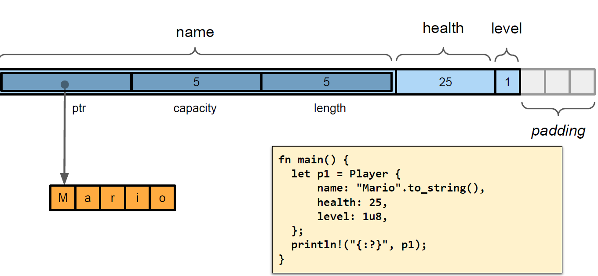
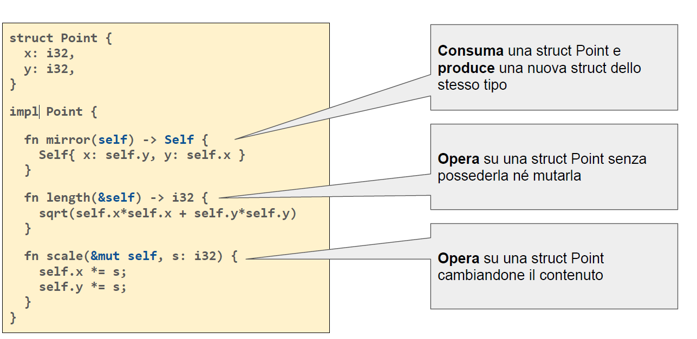
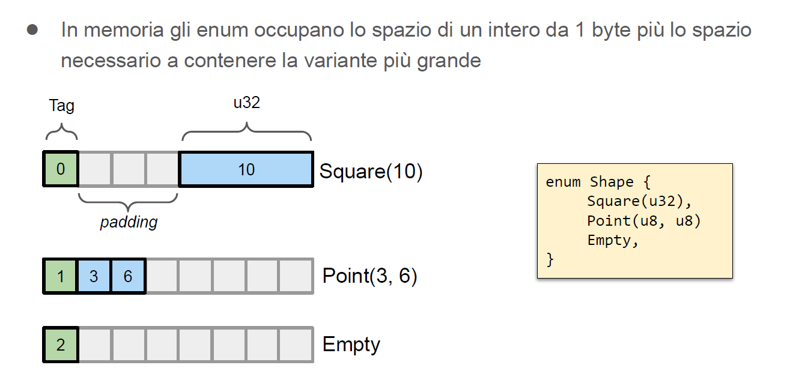
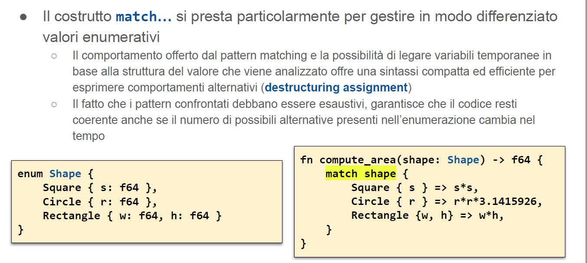
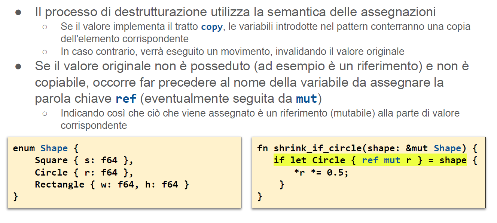
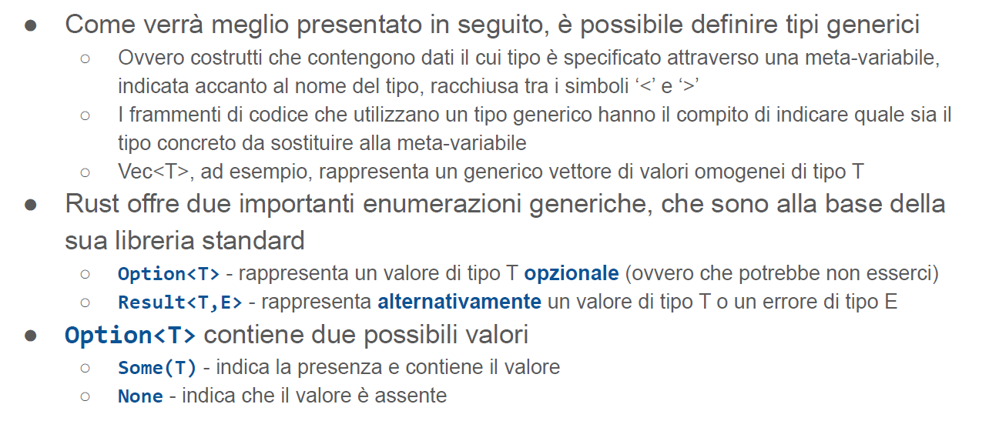
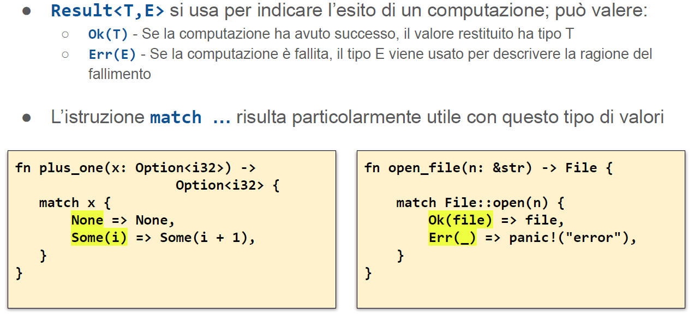

# Struct in rust 
Si utilizza il costrutto **struct** che permette di rappresentare un blocco di memoria in cui sono disposti una serie di campi il cui nome e tipo sono indicati dal programmatore. - ogni struct introduce un nuovo tipo

```rust
struct Player {
    name: String,  // nickname, 24 byte
    health: i32,   // stato di salute (in punti vita),4 byte
    level: u8,     // livello corrente,1 byte

    //dim totale è pari almeno alla somma dei campi (il compilatore potrebbe aggiungere qualcosa in fondo: qua 3 byte per arrivare a 32)
}
```
- Si utilizza la notazione **CamelCase** (struct inizia in maiuscola, seconda parola inizia in maiuscolo). I campi invece seguono la **snake_case** in minuscolo separati da underscore.
- Per istanziare una struct: 
```rust
 let mut s = Player{name : "Mario".to_string(), health:25, level : 1}
 //per instanziare da un'altra struct già esistente :
 //i campi sono tutti presei dalla precedente tranne il name
let s1 = Player {name; "Paolo".to_string(),..s}
//si accede al singolo campo con la notazione puntata: 
s.name
```
## Secondo modo per definire le struct
Potremmo non avere necessità di dare nome esplicito ai campi. 
Le struct di questo tipo si istanziano come una tupla con l'aggiunta del nome della struct.
Si può definire una struct vuota, che non alloca memoria analogamente al tipo ()
```rust
 struct Playground ( String, u32, u32 );
 struct whatever(); // ha dominio nullo, non ha spazio per contenere nulla: è un tipo senza dimensione. E' un marcatore.
 Se torno una struct di questo tipo return whatever => torno qualcosa simile al return void ma che ha un nome e non occupa memoria.
 Il compilatoore mi aiutera a usare in modo coerente quel valore
struct Empty; // non viene allocata memoria per questo tipo di valore. Mi serve  a marcare delle cose
let mut f = Playground( “football”.to_string(), 90, 45 );
let e = Empty;
```

<div style="page-break-after: always;"></div>

## Rappresentazione in memoria
In rust il compilatore può reorganizzare i campi come meglio crede

Davanti alla definizione posso mettere
```rust
#[ repr(...) ]
//unico caso utile è  #[ repr(C) ] : in tal caso non riordina ma ottengo una rappresentazione coerente con le interfacce binarie definite dal linguaggio c 
 ```
 Esistono una serie di funzioni che ci aiutano a lavorare con la memoria
 - **std::mem::align_of(...)** ci da informazioni sull'allineamento richiesto da un tipo
 - **std::mem::size_of(...)** indica la dimensione del tipo 
 - **std::mem::align_of_val(...)** permette di conoscere l’allineamento richiesto da  un particolare valore 
 - la funzione **std::mem::size_of_val(...)** ne indica la dimensione

## Moduli
Fa dell'idea di modulo anche quella di incapsulamento.
 ```rust
 mod Esempio {
     struct  S2 {
        alfa : i32,
        beta : bool
    }
}
 ```

<div style="page-break-after: always;"></div>

Tutto ciò che sta in un modulo non è visibile a meno di dichiararlo pubblico
```rust
mod Esempio {
    pub struct  S2 {
        alfa : i32,
        beta : bool
    }
}
 ```
Per poterlo utilizzare devo scrivere :  

```rust
 use Esempio::S2; //prima del main
```

Ora s2 è visibile ma non i singoli campi (è visibile all'interno del modulo).

Cerco un modo per lavoraci: aggiungo metodi.
In rust i metodi sono separati dalla struttura. Sono affianco alla struct
 ```rust 
 //questo è un metodo della struttura 
 //il metodo è visibile ora
     impl S2{
         #[derive(Debug)] //questo serve a renderlo stampabile 
         //con l'istruzione **println!("{:?}",s2);**
           pub  fn new(alfa:i32, beta: bool) -> Self{ //Self rappresenta il tipo sui cui sto lavorando
                Self{
                    alfa: alfa,
                    beta: beta
                }
            }
     }
//nel main 
let s1 = S1{alfa: 5, beta : false};
Nel main cosi posso creare una nuova struct senza accedere ai singoli campi:
let s2=S2::new(5,false); //funzione costruttrice
println!("{:?}",s1);
 println!("{:?}",s2);
 ```

Struct completamente visibili nel proprio modulo, invisibili fuori. La struct diventa visibile se la rendo pubblica, ma non vuol dire che i singoli campi lo diventano


<div style="page-break-after: always;"></div>


## Visibilità
Sia la struct nel suo complesso che i singoli campo che la formano possono essere preceduti da un **modificatore di visibilità**.
Di base  i campi sono privati : possono essere resi pubblici con la parola chiave pub.
A differenza di quanto avviene in altri linguaggi, in cui struttura e comportamento sono definiti contestualmente in un unico blocco (classe), in Rust la definizione dei metodi associati ad una struct avviene separatamente, in un blocco di tipo **impl**


## Metodi
**Rust non ha il concetto di classe nativo**. 
- Le struct non sono organizzate in una gerarchia di ereditarietà
- il concetto di metodo si applica a tutti i tipi compresi quelli primitivi
- si definiscono i metodi collegati ad un tipo in un blocco racchiuso tra parentesi graffe, preceduto dalla parola chiave ***impl*** seguita dal nome del tipo.
   - le funzioni presenti in tale blocco il cui parametro sia ***self***, **&self o mut self diventano metodi** (self è circa il this )    
   - **le funzioni che non hanno come primo parametro self sono dette funzioni associate** e svolgono il ruolo giocato dai costruttori e dai metodi statici nei linguaggi ad oggetti
```rust
//Metodo getter : ne esistono 3 di base
impl S2{
pub fn getAlfa(self) -> i32  { //passo per movimento
             self.alfa      
         }
}
impl S2{
  pub fn getAlfa(&self) -> i32  { //passo per sola lettura
             self.alfa
         }
}
impl S2{
 pub fn getAlfa(&mut self) -> i32  {
             self.alfa 
         }
}
let  s2=S2::new(5,false);
println!("{:?}",s2.get_alfa()); /*questa va con la seconda*/
//con la prima no perchè perdo il possesso

 let mut  s2=S2::new(5,false);
println!("{:?}",s2.get_alfa()); /*questa va con la terza*/
```


Senza self non sono d'istanza ma costruttrici (tipo metodi statici di java)
Se hanno self come parametro corrispondono ai metodi di istanza


I metodi sono funzioni legate ad un’istanza di un dato tipo
Il legame si manifesta sia a livello sintattico, che a livello semantico
Sintatticamente, un metodo viene invocato a partire da un’istanza del tipo a cui è legato : si usa la notazione **instance.method( … ), dove instance è una variabile del tipo dato (detto anche ricevitore del metodo), e  method è il nome della funzione**. 
Semanticamente, il codice del metodo ha accesso al contenuto (pubblico e privato) del ricevitore **attraverso la parola chiave self*.*
Di fatto, i metodi legati ad una struct vengono implementati sotto forma di funzioni con un parametro ulteriore (chiamato self, &self o &mut self) il cui tipo è vincolato alla struct per la quale sono definiti
```rust 
impl str {
  pub const fn len(&self) -> usize //…
}
/*------------------------------------*/ 
let str1: &str = "abc"; 
println!("{}", str1.len());	       // 3 
println!("{}", str::len(str1));    // 3 , qua metto esplicitamente il ricevitore


```
### Self

Il primo parametro di un metodo definisce il livello di accesso che il codice del metodo ha sul ricevitore .  
- **self** indica che il ricevitore viene passato per movimento, di fatto consumando il contenuto della variabile: è una forma contratta della notazione **self: Self**
- **&self** indica che il ricevitore viene passato per riferimento condiviso: è una forma contratta di **self: &Self**
- **&mut self** indica che il ricevitore viene passato per riferimento esclusivo: è una forma contratta di **self: &mut Self**

Se presente, il parametro self compare come primo elemento nella dichiarazione del metodo.
All’atto dell’invocazione del metodo, esso è ricavato implicitamente dal valore che compare a sinistra del punto che precede il nome del metodo

## Esempio



<div style="page-break-after: always;"></div>


## Costruttori
In rust **non esiste il concetto di costruttore**. 
Qualunque frammento di codice, in un qualunque modulo che abbia visibilità di una data struct e dei suoi campi, può crearne un’istanza, indicando un valore per ciascun campo. 
Per convenzione, un metodo di questo tipo viene chiamato
```rust
pub fn new() -> Self {...}
```
 Poiché Rust non supporta l’overloading delle funzioni, se servono più funzioni di inizializzazione, ciascuna di esse avrà un nome differente: in questo caso la convenzione è utilizzare un pattern come
```rust
pub fn with_details(...) -> Self {...}
```
## Distruttori
### C++
E' uno solo. Si chiama ~nomeclasse.
Il distruttore viene chiamato automaticamente quando la classe esce dal suo scope. Serve a  rilasciare eventuali  risorse contenute nel corpo della classe prima della distruzione.
## Paradigma Raii
**Resource Acquisition Is Inialization:** approccio nato in c++. 
- Le risorse sono incapsulate in una **classe (struttura)** in cui:
  - il **costruttore** acquisisce le risorse e stabilisce eventuali invarianti, oppure lancia un’eccezione se non può essere fatto
  - il **distruttore** rilascia le risorse e NON lancia mai eccezioni
- Si usano le risorse attraverso l’istanza di una classe  RAII-compatibile che:
  - ha una gestione automatica delle durata di tutte le risorse, oppure
  - ha un ciclo di vita connesso al ciclo di vita di un altro oggetto (ad es., è parte di esso)
- In questo contesto, la presenza della semantica del Movimento, garantisce il corretto trasferimento delle risorse, mantenendo la sicurezza del rilascio
- Oggetti Box, String, Mutex e Vec implementano il paradigma RAII

<div style="page-break-after: always;"></div>

## Distruttori in rust


## Metodi statici
In Rust, è possibile implementare metodi analoghi  a quelli di c++ (metodi che non sono legati ad una specifica istanza, ma possono operare sulle istanze della classe ,se ne conoscono l'indirizzo, avendo accesso anche alle componenti private) semplicemente non indicando, come primo parametro, né self né un suo derivato.
Questo permette la creazione di funzioni per la costruzione di un istanza, metodi per la
conversione di istanze di altri tipi nel tipo corrente o, semplicemente, l’accesso a funzionalità
statiche (come nel caso di librerie matematiche o l’accesso in lettura di parametri di
configurazione)
-  L’esempio tipico è il metodo **new**. la chiamata in questo caso sarà usando 
``` rust
  <Tipo>::metodo(...)
```

<div style="page-break-after: always;"></div>

## ENUM
- In Rust, è possibile introdurre tipi enumerativi composti da un semplice valore scalare come in C e C++ o  anche incapsulare, in ciascuna alternativa, una tupla o una struct volta a fornire ulteriori informazioni relative allo specifico valore.
 - Inoltre , è possibile legare metodi ad un’enumerazione aggiungendo un blocco impl.. come nel caso delle struct
 - Ad enum posso associare dei campi ulteriori (ad esempio se NotFound posso associare una stringa che dice cosa non si è trovato )

- enum è grande quanto il più grande dei suoi campi (qua pari a Internal Error + almeno 1 byte di selettore)
- enum lavora insieme a match
- enum è un tipo somma


## Rappresentazione in memoria

- Si genera un byte di selezione chiamato **tag** che sta  all'inizio ( 1 byte se ho 255 al max selezioni, 2 byte per di più ecc)
- ho del padding perchè gli interi devono cominciare a multipli di 4
- qua la struttura è grande 4 + 1 tag + totale per arrivare ad 8 (multiplo di 4)

<div style="page-break-after: always;"></div>

## Match

- Viene introdotta s: s{}: se è uno square introduci la variabile s , se è un circle introduci variabile r che corrisponde al corrispettivo nella struct

## Destrutturazione
- Si usa anche con gli if:
 
- Si usa anche con le assegnazioni semplici
 
 - utilizza la semantica delle assegnazioni
 
 
 <div style="page-break-after: always;"></div>

 ## Enumerazioni generiche
 
 


